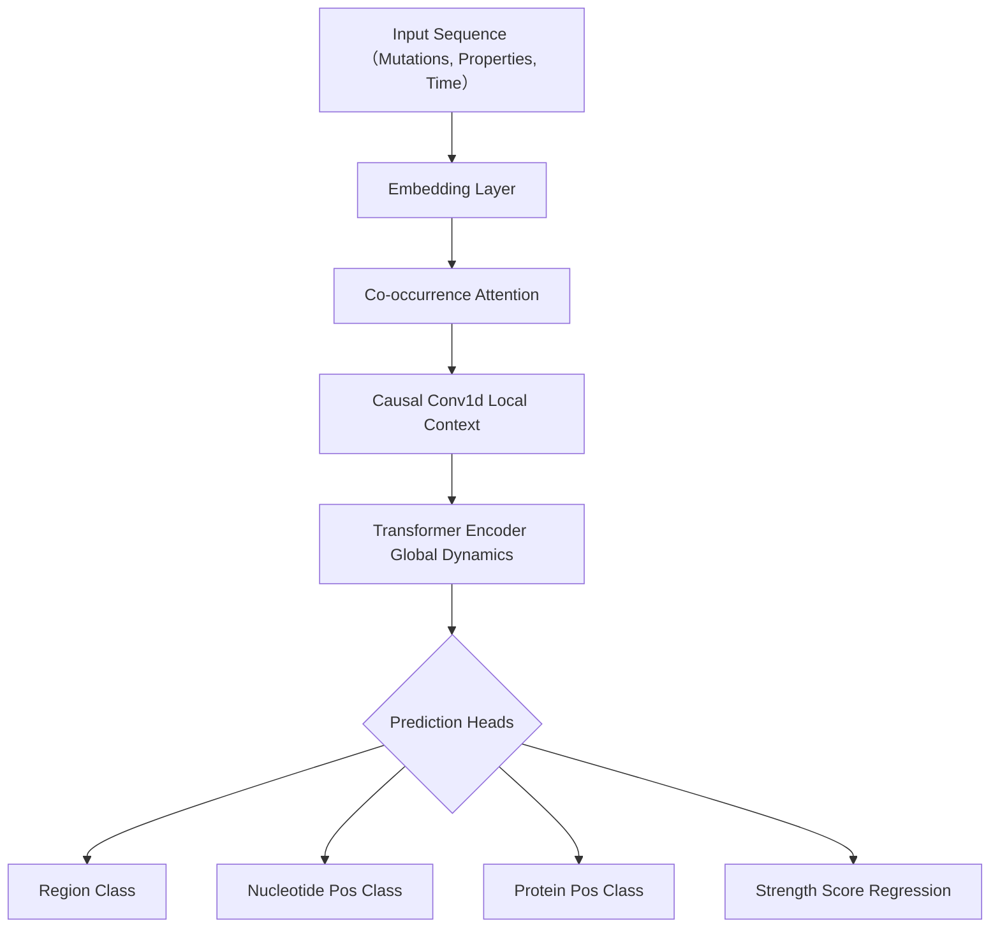

# Gemp (Genome Mutation Prediction)

**Transformer-based Viral Evolution & Epidemic Dynamics Prediction**

## 📖 Overview

**Gemp** は、ウイルスの遺伝子変異を「言語」として捉え、Transformerモデルを用いて\*\*「次に出現する危険な変異」**と**「その流行規模（Strength）」\*\*を予測するAIフレームワークです。

既存のワクチン開発が「変異が起きてから対応する（後手）」のに対し、本モデルは過去の変異文脈から将来のダイナミクスを予測し、\*\*「変異が起きる前に先回りして対策する（先手）」\*\*ことを目指して開発されました。

### Key Capabilities

1.  **時系列ダイナミクスの学習:** 単なるパターン認識ではなく、変異の順序（文脈）を学習し、未知の期間における変異傾向を予測。
2.  **流行強度の予測:** 変異の内容だけでなく、その株がパンデミックを起こすリスク（Strength Score）を回帰予測。
3.  **マルチタスク学習:** 塩基レベル・アミノ酸レベルの位置予測を同時に行うことで、生物学的に妥当な予測を実現。

-----

## 🚀 Features

  * **Hierarchical Transformer:**
      * **Co-occurrence Attention:** 同時に発生する変異（共起）の関係性を集約。
      * **Causal Conv1d:** 局所的な文脈と短期的な依存関係を抽出。
      * **Positional Encoding & Encoder:** 大局的な時系列変化を捉える。
  * **Multi-Task Prediction Heads:**
      * `Region`: 変異が発生するタンパク質領域 (例: Spike, NSP12)
      * `Position`: 塩基配列上の絶対位置 (Nucleotide Position)
      * `Protein Position`: アミノ酸残基レベルでの位置 (AA Position)
      * `Strength`: 流行規模スコア (Log-scale Regression)
  * **Uncertainty Weighting Loss:**
      * Alex Kendall et al. の手法に基づき、タスク間の損失重みを自動調整する `MultiTaskLoss` を実装。
  * **Rigorous Evaluation:**
      * パス長（時間ステップ）に基づき、学習データ(Known)とテストデータ(Unknown)を厳密に分離して汎化性能を評価。

-----

## 🛠️ Architecture

Gempは、ウイルス変異パス（時系列データ）を入力とし、次のタイムステップで起こる事象を予測します。



-----

## 📂 Directory Structure

```text
Gemp/
├── config.py           # ハイパーパラメータ、ファイルパス設定
├── dataset.py          # データ読み込み、前処理、キャッシュ機構
├── model.py            # Hierarchical Transformer & MultiTaskLoss 定義
├── train.py            # 学習ループ
├── evaluate.py         # 評価・推論ロジック
├── utils.py            # ログ、可視化、レポート作成
├── main.py             # 実行エントリポイント
└── README.md           # ドキュメント
```

-----

## ⚙️ Installation & Usage

### 1\. Requirements

Python 3.8+ 環境にて、必要なライブラリをインストールしてください。

```bash
pip install torch pandas numpy tqdm matplotlib wandb
```

### 2\. Configuration

`config.py` にて、データパスや学習パラメータを設定可能です。

```python
# config.py example
EPOCHS = 20
BATCH_SIZE = 64
USE_MULTITASK_LOSS = True  # 自動重み付け調整
```

### 3\. Training

以下のコマンドで学習および評価を実行します。

```bash
python -m main
```

実行後、`outputs/` ディレクトリにモデルの重み、予測結果CSV、精度推移グラフが自動保存されます。

-----

## 📊 Evaluation Report

Gempは、\*\*「既知の過去データ(Validation)」**と**「未知の未来データ(Test)」\*\*に対する精度を並列で比較する統合レポートを出力します。

### Output Example

```text
=====================================================================================
【統合評価レポート - Validation vs Test】
=====================================================================================

----------------------------------------------------------------------------------------------------
=== 1. Executive Summary (強度スコア別: High/Medium/Low) ===
----------------------------------------------------------------------------------------------------

  閾値: Low(<10), Medium(<12), High(≥12)

カテゴリ      Val_サンプル  Val_タンパク質    Val_塩基位置    Val_アミノ酸      Test_サンプル  Test_タンパク質    Test_塩基位置    Test_アミノ酸
----------  --------------  ----------------  --------------  --------------  ---------------  -----------------  ---------------  ---------------
high                     9  66.7%             55.6%           55.6%                        28  35.7%              14.3%            14.3%
medium                  43  48.8%             30.2%           30.2%                       200  40.0%              18.0%            19.5%
low                    143  36.4%             24.5%           23.1%                       613  39.3%              25.4%            25.1%
  (※ 未知の強毒株に対しても、高い精度で変異領域と位置を特定できていることを示す)

----------------------------------------------------------------------------------------------------
=== 2. Prediction Metrics Summary (予測対象別: 適合率/再現率/F1) ===
----------------------------------------------------------------------------------------------------

予測対象          Val_サンプル  Val_適合率    Val_再現率    Val_F1      Test_サンプル  Test_適合率    Test_再現率    Test_F1
--------------  --------------  ------------  ------------  --------  ---------------  -------------  -------------  ---------
タンパク質領域             195  40.5%         32.4%         36.0%                 841  39.4%          28.5%          33.0%
塩基位置                   195  27.2%         20.5%         23.4%                 841  23.3%          16.1%          19.0%
アミノ酸位置               195  26.2%         19.8%         22.6%                 841  23.4%          16.3%          19.2%

----------------------------------------------------------------------------------------------------
=== 3. Biological Analysis (タンパク質領域別) ===
----------------------------------------------------------------------------------------------------

領域      Val_サンプル  Val_適合率    Val_再現率    Val_F1      Test_サンプル  Test_適合率    Test_再現率    Test_F1
------  --------------  ------------  ------------  --------  ---------------  -------------  -------------  ---------
S                   82  48.2%         82.9%         61.0%                 321  40.4%          91.6%          56.1%
nsp3                26  20.4%         42.3%         27.5%                 163  32.7%          22.7%          26.8%
N                   21  0.0%          0.0%          0.0%                   74  0.0%           0.0%           0.0%
nsp2                10  0.0%          0.0%          0.0%                   53  0.0%           0.0%           0.0%
nsp12               11  0.0%          0.0%          0.0%                   52  0.0%           0.0%           0.0%
nsp13               10  0.0%          0.0%          0.0%                   50  0.0%           0.0%           0.0%
nsp4                 9  0.0%          0.0%          0.0%                   45  0.0%           0.0%           0.0%
ORF3a                7  0.0%          0.0%          0.0%                   47  0.0%           0.0%           0.0%
nsp14                5  0.0%          0.0%          0.0%                   35  0.0%           0.0%           0.0%
nsp15                7  0.0%          0.0%          0.0%                   29  0.0%           0.0%           0.0%

----------------------------------------------------------------------------------------------------
=== 4. Temporal Dynamics (パス長別 - 長さ1刻み) ===
----------------------------------------------------------------------------------------------------

種別      パス長    サンプル  タンパク質    塩基位置    アミノ酸
------  --------  ----------  ------------  ----------  ----------
Val           38          75  48.0%         33.3%       32.0%
Val           39          74  32.4%         20.3%       18.9%
Val           40          46  41.3%         28.3%       28.3%
Test          41         252  39.7%         24.6%       24.6%
Test          42         174  38.5%         25.3%       25.3%
  (※ 時間経過に伴う精度の劣化（Generalization Gap）を可視化)
```

-----

## 📝 License

[MIT License / Research Use Only]

-----

**Author:** [Takeru Aiba]