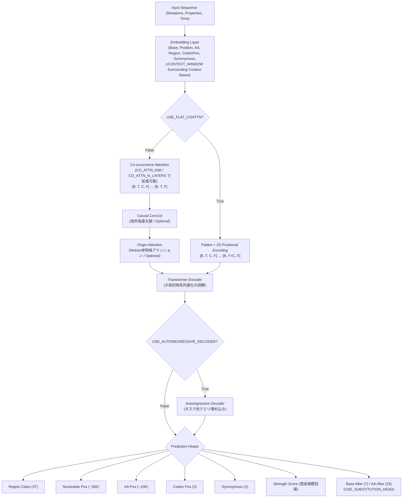

# 🧬 Viral Genome Mutation Prediction Model (v260702)

本プロジェクトは、新型コロナウイルス（SARS-CoV-2）をはじめとするウイルスゲノムの変異発生予測を行う、高度な時系列マルチタスク・ディープラーニングモデル（Hierarchical Transformer）のコードベースです。
変異の時系列的な蓄積ステップ（Mutation Step）と、同時に発生した共起変異の集合を高度にモデル化し、将来のパンデミックを引き起こす変異の早期予測と進化シミュレーションを実現します。

---

## ✨ 主要機能（v260702 搭載機能）

- **NCBI/UShERダブル系統名・流行度システムの統合（動的切り替え）**
  - 配列メタデータ上の系統名（NCBI）と、系統樹トポロジー上の placements から得られる系統名（UShER）の双方をDBに抽出し、保持・表示。
  - UShERの `clades.txt` からNextclade名（Clade最頻値）およびサンプル数を自動集計する機構を導入。
  - `config.STRENGTH_SOURCE` の切り替え（`'ncbi'` / `'usher'`) だけで、モデル学習や評価時に参照する系統名・流行度を動的に切り替え可能。

- **ホスト適応特徴量の統合（24次元）**
  - `reference/codon/SCV2_host_adaptation_features.csv` に集約された24種類のコドン組成ベース特徴量を数値入力に追加。
  - ヒト・SCV2 の RSCU・コドン頻度・CAI（相対的適応度）の変異前後の値と差分、コドン最適性フラグ（optimal_to_optimal 等）、トランジション/トランスバージョン、CpG/UpA ジヌクレオチド変化量、宿主距離対数比などを網羅。
  - `reference/codon/generate_host_adaptation_features.py` で再生成可能。

- **パス内累積変異カウント特徴量の追加**
  - 入力パスにおけるシノニマス変異・ノンシノニマス変異それぞれの累積カウントを数値特徴量（`cum_syn`/`cum_nonsyn`）として追加。
  - 各タイムステップ開始前の累積値を渡すため、同一タイムステップ内の共起変異は全て同じ値を参照する。

- **亜系統の流行ダイナミクス特徴（4次元・因果的な適応度代理）**
  - 各サンプル（亜系統 × 収集日）に、**収集日以前のデータだけ**で計算した4つの成長特徴を数値入力に追加（`USE_LINEAGE_GROWTH_FEATURES`）。適応度は「どの変異が出現・拡大するか」を駆動するため、位置予測の文脈情報になる。
  - `lineage_log_count_recent`（規模の因果版）/ `lineage_growth_rate`（直近K週の log件数の傾き＝勢い、正=拡大・負=縮小）/ `lineage_rel_growth_adv`（logit シェアの傾き＝共流行系統に対する**相対成長優位＝logistic fitness**）/ `lineage_growth_accel`（加速度＝ピークアウト検知）。
  - epidemic 件数は系列メタCSV（`Pangolin` × `Collection_Date`）から週次で構築（`db/growth_features.py`）。系統粒度は Pango 上位2階層。「縮小期の件数」等の**未来量は使わずリークを防止**し、位相は `growth_rate` の符号で表現する。
  - 有効化すると `NUM_CHEM_FEATURES` が 32→36 に増え **DB 再構築が必要**。効果は permutation importance／ablation／walk-forward で検証する（既存 `strength` との冗長性・リークの有無を確認）。

- **前後コンテキスト塩基の窓幅拡張（`CONTEXT_WINDOW` で制御）**
  - 変異位置の前後塩基を `config.CONTEXT_WINDOW`（デフォルト ±5）で動的に制御。±3/±5/±7 を config の変更だけで切り替え可能。
  - カテゴリ特徴量 = 9（固定）+ 2×CONTEXT_WINDOW（コンテキスト）。
  - アブレーションマスクも `MUTATION_CONTEXT_L1`〜`L7` / `R1`〜`R7` で1塩基単位の個別制御に対応。

- **高精度マルチタスク学習**
  - 変異の発生する「遺伝子領域（37分類）」、「ゲノム位置（~3万分類）」、「アミノ酸位置（~1万分類）」、「コドン内位置（3分類）」、「同義/非同義（2分類）」、「塩基変化先（7分類）」、「アミノ酸変化先（23分類）」、およびその変異株の「流行規模（Strength Score / 回帰）」をマルチタスクで同時に学習・予測。

- **時系列マルチタスクの学習**
  - 変異の時系列ステップ（Mutation Step）に伴う進化の遷移を学習し、未知の時間の経過に合わせて変異発生時期を高度に予測。

- **Co-occurrence Attention の多段階拡張（Omicron期大規模共起への対応）**
  - `CO_ATTN_DIM`（内部次元拡大）、`CO_ATTN_N_LAYERS`（変異間 Self-Attention の多段化）、`USE_FLAT_COATTN`（全変異を独立トークンとして Transformer に直接入力）の3フラグで共起集約の表現力をアブレーション比較可能。

- **DuckDB による超高速データベース＆バルク処理**
  - 数百万レコードに及ぶ大規模な変異パスとゲノムメタデータを DuckDB で管理し、メモリ効率的かつ高速なストリームバッチ学習を実現。

- **多角的な評価・出力システム**
  - 感染規模9区分（〜100/〜500/〜1K/〜5K/〜10K/〜50K/〜100K/〜500K/>500K）の精度ファイル分割。
  - 系統（Pango 上位2階層）単位でのHitRate・予測難易度エントロピーを集計した `{prefix}_lineage_metrics.csv` を常時出力。
  - 実験横断スクリプト比較のための `run_summary.json`（主要指標を軽量JSONで保存）。
  - `USE_R_PRECISION=True` 時の R-Precision 結果を独立ファイル `{prefix}_r_precision.csv` に保存。

- **メンテナンスフリーな動的ロギング**
  - バージョンアップに伴う日付コードの置換漏れを防ぐため、エラーログメッセージ内のパッケージ名を `{__package__}` を用いて自動取得するよう動的化。

- **実験ハーネス・高速化・分析ツール（v260702 拡張）**
  - **マルチシード検証**（mean±std 集計）・**Walk-forward 検証**（半年次7フォールド）・**Optuna ハイパラ探索**（オフライン SQLite・pruning）の3ハーネス。
  - **DataLoader 並列化**によるデータ律速の解消（実測 ~2.0x）、**プロット出力の個別トグル**、**早期終了の hit-rate 対応**。
  - **特徴量重要度**（Permutation＝精度寄与 / Gradient×Input＝感度）に加え、**生物学的 XAI スイート**（ゲノムトラック／ホモプラシー整合／コンステレーション復元／Integrated Gradients 局所説明／表現プロービング）を単独スクリプトで提供。`run_all_xai` で一括実行可。
  - 詳細は「⚙️ 学習設定・実験ハーネス・高速化」節および「🚀 Usage → 6. 特徴量重要度・生物学的 XAI 分析」を参照。

---

## 🛠️ Architecture（アーキテクチャ）

同時に発生した共起変異の集合順序への依存性を解消し、位置エンコーディングの矛盾を防ぐための **Co-occurrence Attention (共起集約層)** を中核とする革新的なネットワーク構造です。


```mermaid
graph TD
    Input["Input Sequence (Mutations, Properties, Time)"] --> Embed["Embedding Layer\n(Base, Position, AA, Region, CodonPos, Synonymous,\n±CONTEXT_WINDOW Surrounding Context Bases)"]

    Embed --> FlatSwitch{USE_FLAT_COATTN?}
    FlatSwitch -->|False| CoAttn["Co-occurrence Attention\n(CO_ATTN_DIM / CO_ATTN_N_LAYERS で拡張可能)\n[B, T, C, F] → [B, T, F]"]
    FlatSwitch -->|True| FlatSeq["Flatten + 2D Positional Encoding\n[B, T, C, F] → [B, T×C, F]"]

    CoAttn --> Conv["Causal Conv1d\n(局所塩基文脈 / Optional)"]
    Conv --> OriAttn["Origin Attention\n(Wuhan参照株アテンション / Optional)"]
    OriAttn --> Transformer

    FlatSeq --> Transformer["Transformer Encoder\n(大局的時系列進化の読解)"]

    Transformer --> ARSwitch{USE_AUTOREGRESSIVE_DECODER?}
    ARSwitch -->|False| Heads{"Prediction Heads"}
    ARSwitch -->|True| ARDec["Autoregressive Decoder\n(タスク別クエリ埋め込み)"]
    ARDec --> Heads

    Heads --> Out1["Region Class (37)"]
    Heads --> Out2["Nucleotide Pos (~30K)"]
    Heads --> Out3["AA Pos (~10K)"]
    Heads --> Out4["Codon Pos (3)"]
    Heads --> Out5["Synonymous (2)"]
    Heads --> Out6["Strength Score (感染規模回帰)"]
    Heads --> Out7["Base After (7) / AA After (23)\n(USE_SUBSTITUTION_HEAD)"]
```

### 入力特徴量

| 種別 | 次元数 | 内容 |
|---|---|---|
| カテゴリ特徴量 | `9 + 2×CONTEXT_WINDOW` | base_before, position, base_after, codon_pos, aa_before, aa_pos, aa_after, region, synonymous, 前後コンテキスト塩基 |
| 数値特徴量 | 32（+4） | 物理化学6 + ホスト適応24 + 累積変異カウント2（+ 亜系統成長4：`USE_LINEAGE_GROWTH_FEATURES=True` で計36） |

### シーケンスデータ
#### condition
##### reference/sequences-241017.csv (2024/10/18)
Virus/Taxonomy:Severe acute respiratory syndrome coronavirus 2, taxid:2697049
Sequence Length min:29000 max:30000
Host:Homo sapiens (human), taxid:9606
Release Date: From Jan 1, 2020 To Oct 18, 2024
number : 8,938,263

##### reference/sequences-241017_2.csv (2026/07/10)
Virus/Taxonomy:Severe acute respiratory syndrome coronavirus 2, taxid:2697049
Sequence Length min:29000 max:30000
Host:Homo sapiens (human), taxid:9606
Release Date: From Oct 18, 2024 To Jul 10, 2026
Collection Date: From Jan 1, 2020 To Oct 18, 2024
number : 8,938,263

---

## 🚀 Usage（実行方法）

### 1. 環境構築

```bash
# conda 環境を新規作成（初回のみ）
conda env create -f environment.yml

# または pip で依存パッケージをインストール
pip install -r requirements.txt
pip3 install torch torchvision

# 環境を有効化
conda activate gvp25-05
```

### 2. UShER 出力の変換（初回のみ）
```bash
python -m transformer_260702.scripts.preprocess.data_format
```

### 3. DuckDB データベースの前処理（初回 or DB 再構築時）
```bash
nice -n 19 python -m transformer_260702.preprocess
```
`config.py` の `NUM_CHEM_FEATURES`・`CONTEXT_WINDOW`・`ABLATION_MASKS` が変更されると、設定ハッシュが自動的に変わり次回実行時に DB が再構築される。

### 4. モデルの学習および評価の実行
```bash
nohup python -m transformer_260702.main > nohup0.out 2>&1 &
tail -f nohup0.out
```
実行完了後、`outputs/transformer_260702/results/<EXPERIMENT_NAME>/<timestamp>/` にすべてのログ、学習曲線、集計CSV、および評価プロット画像が自動保存される。

### 5. 実験ハーネス（複数シード検証・ハイパラ探索）
```bash
# 複数シードで学習→評価し、主要指標を mean±std に集計（single run のノイズ判定用）
python -m transformer_260702.scripts.eval.multi_seed --seeds 42 1 7
#   → results/multi_seed/<ts>/multi_seed_summary.json（aggregate に mean/std/values）

# 半年次 Walk-forward 検証（全7フォールド。config.SPLIT_MODE を触らず起動可）
nohup python -m transformer_260702.scripts.eval.walk_forward > nohup_wf.out 2>&1 &
python -m transformer_260702.scripts.eval.walk_forward --folds 2 6   # 特定フォールドのみ

# Optuna ハイパラ探索（ローカル SQLite 保存＝オフライン・中断再開可、pruning つき）
pip install optuna   # 未導入の場合
python -m transformer_260702.scripts.eval.optuna_search --n-trials 15 --params lr loss_weights
#   → outputs/.../scripts/optuna/<study>.db（全 trial 履歴）, <study>_best.json（ベスト構成）
```
> **探索コストの目安**: 1 trial = 1 学習（実測 1 epoch ≈ 40〜70 分）。フル 15 epoch × 多 trial は数日規模になるため、探索は短 epoch・少 trial（＋pruning）で回し、上位構成のみ multi-seed / walk-forward でフル検証する二段構えを推奨。

### 6. 特徴量重要度・生物学的 XAI 分析
学習済みチェックポイントに対する後付け分析。すべて単独 CLI（`--checkpoint` 指定、`--force_cpu` 対応）で、共通基盤 `scripts/analysis/_xai_common.py`（config_snapshot 反映・モデル/ローダ・出力保存を集約）の上に載る。

```bash
# 特徴量重要度（数値特徴32/36次元）
python -m transformer_260702.scripts.analysis.feature_importance --checkpoint <best.pth>        # Gradient×Input（感度）＋埋め込みノルム＋Co-Attn重み
python -m transformer_260702.scripts.analysis.permutation_importance --checkpoint <best.pth> \
    --metric position_hit_rate --n_batches 50 --n_repeats 2                                      # 精度寄与（再学習不要）

# 生物学的 XAI（位置→遺伝子 annotation・外部データと突き合わせ）
python -m transformer_260702.scripts.analysis.genome_track --checkpoint <best.pth>               # ①位置/遺伝子別の予測質量 → ゲノム地図
python -m transformer_260702.scripts.analysis.homoplasy_alignment --checkpoint <best.pth>        # ②重要度 vs homoplasy 相関＋problematic 負コントロール
python -m transformer_260702.scripts.analysis.cooccurrence_constellation --checkpoint <best.pth> # ③共予測ペア vs 実共起（変異株コンステレーション復元）
python -m transformer_260702.scripts.analysis.local_explain --checkpoint <best.pth>              # ④Integrated Gradients による1予測の局所説明
python -m transformer_260702.scripts.analysis.probe_representation --checkpoint <best.pth>       # ⑤内部表現の線形プロービング（gene/Spike/同義 を復元できるか）

# ↑の新規5本を一括実行（出力を xai_all/<ts>/<analysis>/ に集約、失敗継続）
python -m transformer_260702.scripts.analysis.run_all_xai --checkpoint <best.pth> --split test
#   --only / --skip で対象選択、--n_batches で共通上書き、--force_cpu、--dry_run（コマンド確認のみ）
```

| 分析 | 何を見るか | 主な外部データ |
|---|---|---|
| `genome_track` | モデルが Spike/RdRp 等の意味ある領域に注目しているか | `codon_mutation4.csv`（遺伝子annotation） |
| `homoplasy_alignment` | 重要部位が**正の選択下の収斂部位**と一致するか／アーチファクト部位を回避しているか | `homoplasy/site_recurrence.csv`, `problematic_sites…vcf` |
| `cooccurrence_constellation` | 既知ハプロタイプ（連鎖・エピスタシス）を再発見しているか | — |
| `local_explain` | 個々の予測を「どの過去変異・特徴が押し上げたか」に帰属 | — |
| `probe_representation` | 内部表現に生物概念（遺伝子/Spike/同義）が符号化されているか | — |

### ユーティリティ
```bash
python -m transformer_260702.scripts.inspect.inspect_duckdb    # DB スキーマ確認
python -m transformer_260702.scripts.inspect.view_one_sample   # サンプル内容確認（数値特徴量を表示。成長特徴有効時は36次元）
python -m transformer_260702.scripts.analysis.aggregate_strains    # 株別集計
python -m transformer_260702.scripts.analysis.aggregate_lineages   # 系統別集計
python -m transformer_260702.scripts.analysis.aggregate_variants   # 月別変異株集計
```

---

## 📊 Evaluation Metrics（評価指標）

- **Hit Rate（サンプル単位精度）**
  - 各サンプルについて「Top-K予測の中に、実際に発生した共起変異が1つでも含まれるか」を測定。

- **Weighted Recall@1 / Macro Recall@1（クラス単位評価）**
  - クラス不均衡が極めて大きい遺伝子位置予測において、高頻度クラスを重視する Weighted と、稀なクラスも公平に評価する Macro の双方でリコールを測定。

- **感染規模カテゴリ別精度**
  - `log(1 + sample_count)` スケールで **Low/Medium/High の3区分** と **9区分の細分化**（〜100/〜500/〜1K/〜5K/〜10K/〜50K/〜100K/〜500K/>500K）でカテゴリ別精度を保存。
  - `config.SAVE_STRAIN_METRICS = True` で株単位の `{prefix}_strain_metrics.csv` も出力可能。

- **系統別精度・予測難易度（`{prefix}_lineage_metrics.csv`）**
  - Pango lineage の上位2階層（例: BA.2, XBB.1）でグループ化。
  - 各系統のHitRateに加え、ターゲット変異位置分布のエントロピー（予測難易度）を集計。

- **R-Precision（`{prefix}_r_precision.csv`）**
  - `USE_R_PRECISION=True` 時、各サンプルの実際の共起変異数 $R$ を $K$ とした動的 Top-$R$ 評価結果を独立ファイルに保存。

- **run_summary.json**
  - 実験ごとに HitRate@K・Macro Recall・Val/Test Loss を1ファイルにまとめた軽量JSON。

---

## 🔍 精度特性の分析と根本課題

### Omicron 出現期（2021/12）以降の精度低下

`outputs/transformer_260625/scripts/timestep/timestep_by_month.png` が示すように、2021/12 を境にタイムステップ分布が急変する。

- **2021/12 以前**: Wuhan → Alpha → Delta の比較的線形な進化。各タイムステップで支配的な変異がほぼ一意に定まる。
- **2021/12**: Omicron（BA.1）の出現。18 個の創始変異を持つ新系統が爆発的に広がり、タイムステップ分布が二峰性（Delta 後期の長パス ＋ Omicron 起点の短パス）に乖離。
- **2022 年以降**: BA.1 → BA.2 → BA.4/5 → XBB → JN.1 と急速なサブ系統分化が続く。

### 根本原因：ターゲットエントロピーの爆発

`test_lineage_metrics.csv` を解析した結果、精度低下の主因は **Co-occurrence Attention の容量不足ではなく、予測ターゲットのエントロピーの高さ** であることが確認された。

| 正規化エントロピー | 系統数 | サンプル数 | position Hit Rate |
|---|---|---|---|
| < 0.5 | 4 | 110K | **72%** |
| 0.5–0.7 | 24 | 34K | **66%** |
| 0.7–0.85 | 7 | 6K | **47%** |
| **> 0.85** | **49** | **130K** | **3.7%** |

テストセット全体の約半数（130K サンプル）が entropy_norm > 0.85 に属し、位置 Hit Rate がほぼゼロになる。

**なぜエントロピーが高くなるか**

UShER 系統樹の**内部ノード**（多くのサブ系統への分岐点）に対応するサンプルでは、各子孫が異なる変異を積んでいる。`raw_y_batch` は全子孫経路のターゲットを合算するため、分岐が多いほどターゲット集合のエントロピーが爆発する。entropy_norm = 0.90（≈ 12.6 bit）は、「次の変異」の候補が 2^12.6 ≈ 6,000 位置以上に分散していることを意味し、Top-1 予測は数学的にほぼ不可能となる。

Delta の AY.44（39K サンプル、entropy_norm = 0.90、position Hit Rate **1.7%**）がその典型例。Omicron 系統はさらに急速な多様化により同様の問題が深刻化する。

#### Walk-forward による時系列での再確認（2026-07, `results/walk_forward/20260705_203818`）

半年次 7 フォールド（USE_PRETRAINING=True, MODE='mlm'、全 Pre-Alpha〜最新期）の test を entropy_bin ごとにサンプル数で重み付けプールした結果、上記の崩壊パターンが**単一 run の偶然ではなく、時系列を通した一貫した構造**であることを確認した（n=1,874,833、`entropy_bin_pooled_all_folds.csv`）。

| entropy_bin | n | region | **position** | aa_pos | codon_pos | synonymous |
|---|---:|---:|---:|---:|---:|---:|
| 0.4〜0.5 | 327,142 | 73.2% | 67.5% | 68.2% | 79.8% | 88.8% |
| 0.5〜0.6 | 120,600 | 68.1% | 59.8% | 61.2% | 77.3% | 87.6% |
| 0.6〜0.7 | 148,887 | 62.4% | 52.7% | 54.5% | 73.1% | 85.1% |
| 0.7〜0.8 | 55,498 | 49.0% | 34.7% | 36.6% | 65.2% | 82.5% |
| **0.8〜0.9** | 582,853 | 21.6% | **0.58%** | 4.5% | 48.6% | 69.0% |
| **0.9〜1.0** | 638,746 | 26.1% | **1.66%** | 6.7% | 53.7% | 71.2% |

- **崖の位置が明確**: 0.7〜0.8（34.7%）→ 0.8〜0.9（0.58%）で position 精度が約60倍崩壊する、はっきりした閾値がある。
- **全サンプルの約65%（122万/187万）が崖の向こう側**（entropy ≥ 0.8）に属する。
- **粒度による崩壊差を時系列全体で再確認**: 同じ 0.9〜1.0 帯でも position=1.66% に対し codon_pos=53.7%・synonymous=71.2%・region=26.1% と、粗い粒度は崩壊を免れる。→ 下記「3. 階層的予測」の価値はこの崖の向こう側（全体の6割強）でこそ発揮される。
- **系統別のフォールド間比較でも仮説を支持**: Delta 中心の Fold（position Hit Rate 約30%）と Omicron 期に入った直後の Fold（同 約7.5%）を比べると、後者はテストサンプルの9割以上が entropy 0.9〜1.0 帯に集中しており、母集団のエントロピー構成の違いがそのまま精度差として現れている。

この崖（0.7〜0.8）は「本質的に予測不能な領域」との境界とみなせ、下記「2. エントロピーによる学習サンプルフィルタリング」の閾値候補として妥当性が高い。

### Co-occurrence Attention の容量拡張が無効な理由

Co-occurrence Attention は**入力側の集約表現**（同時発生変異をどう読むか）を改善する機構であり、**出力ラベルの多義性**は解消できない。どれだけ容量を増やしても、正解が 6,000 位置に均等分散していれば Top-1 Hit Rate はゼロのまま変わらない。

一方、**Region Hit Rate は高エントロピー系統でも 34%** を維持している。モデルは「大まかな領域」は学習できているが「正確な位置」は絞り込めない状態にある。

### 改善の方向性

#### 1. 評価指標の転換（最優先・実装済み）

`USE_R_PRECISION = True` で有効になる **R-Precision**（K = ターゲット変異数の動的評価）が高エントロピー系統に対して唯一公平な指標となる。Top-1 Hit Rate ではなく R-Precision をモデル選択の主指標とすること。

#### 2. エントロピーによる学習サンプルフィルタリング

学習時にターゲットエントロピーが閾値を超えるサンプルを除外し、「学習可能なサンプル」（低エントロピー）に集中する。これにより勾配ノイズが減り、低エントロピー系統での精度が向上する。

**ステータス**: 実装済み。系統別の正規化ターゲット位置エントロピーを `labels` テーブルから動的算出（`db/queries.py:compute_lineage_entropy_map`, `cache/` にキャッシュ）し、`db/dataset.py` が **Train split のみ** 閾値超過系統のサンプルを除外する。preprocess 再実行は不要。valid/test は除外しない（層別評価のため）。

```python
# config.py（節「12. 改善の方向性 2〜5」）
USE_TRAIN_ENTROPY_FILTER = True
TRAIN_ENTROPY_MAX = 0.7   # 正規化エントロピーの上限（要チューニング）
# ↑ walk-forward プール分析（上記）で 0.7〜0.8 に精度崩壊の崖を確認。0.7 は妥当な既定値だが
#   0.8 側も試す価値あり（0.7〜0.8 帯は 34.7% とまだ一定の予測可能性が残るため）。
```

#### 3. 階層的予測（Region → Position 分解）

Region Head（34% 有効）を第一段階のゲートとして使い、**当該 Region 内の位置のみを対象とした Position 予測**を行う。30K クラス問題を「37 系統を選ぶ」+ 「選んだ系統内 ≈ 800 位置を選ぶ」に分解することで、探索空間が 1/37 に圧縮される。

実装方式は以下の 3 段階で段階的に導入できる。学習時間の増加は Option A・B ではほぼゼロ。

| Option | 概要 | 学習フロー変更 | 学習時間増加 |
|---|---|---|---|
| **A: 推論時マスキング** | 予測 Region 外の Position ロジットを `-inf` でマスクして softmax | なし（evaluate.py のみ変更） | **ゼロ** |
| **B: 条件付き Position Head** | Position head の入力に正解 Region の one-hot（37次元）を追加。学習時は Teacher Forcing、推論時は予測 Region を使用 | モデル構造・学習ループの軽微な変更 | **<5%** |
| **C: 2段階モデル** | Region モデルと Position モデルを完全に分離して独立学習 | 2回の学習実行が必要 | **約1.5〜2倍** |

**推奨順序**: まず Option A で効果を検証 → 有効なら Option B へ移行。walk-forward 評価との組み合わせで Region ゲーティングの有効性を定量化する。

**ステータス**: Option A（推論時マスキング）実装済み。`USE_HIERARCHICAL_PREDICTION=True` で有効化。`evaluate.py` が予測 Region 上位 `HIERARCHICAL_TOPK_REGIONS` 個に属さない位置の Position ロジットを `-inf` マスクしてから topk/softmax を行う。位置→領域の写像は `db/queries.py:get_position_region_map`（`labels` から多数決で構築・`cache/` に保存）。学習は不変・学習時間増加ゼロ。Option B/C は未実装。

**高エントロピー領域への対応可否について**: 塩基位置ピンポイントの的中率は、上記の崖（entropy ≥ 0.8）の内側では本質的な不確実性（複数の准中立的な免疫逃避経路が並立し、どれが実際に広がるかは伝播の確率的要素に強く依存）により、大幅な改善は非現実的と考えられる。ただし walk-forward プール分析が示す通り、**同じ高エントロピー帯でも粒度を下げれば依然として予測可能**（0.9〜1.0 帯: position 1.66% に対し codon_pos 53.7%・synonymous 71.2%・region 26.1%）。したがって「エントロピーを消す」のではなく「粒度を下げる／集合・分布で答える／不確実性を正直に申告する」方向に対応をずらすのが現実的:
- **階層的予測（本節）**: 崖の内側では region/codon_pos 等の粗い粒度を主出力にする。
- **集合・分布予測**: R-precision（実装済み）、Mixture Position Head（提案8）で多峰分布を許容。
- **選択的予測・棄却（提案9）**: 不確実性が高い文脈では断定を避け、広く監視対象に上げる判断を出力する。

#### 4. 系統埋め込みの追加（分布シフト対策）

Omicron の 18 創始変異による入力分布シフトに対応するため、主要系統クレード（Wuhan / Alpha / Delta / BA.1 / BA.2 / BA.4-5 / XBB / JN 等）の Embedding を入力に追加する。これはエントロピー問題の主因ではないが、Omicron 固有の入力分布を明示的に扱える点で補完的に有効。

**ステータス**: 実装済み。`USE_CLADE_EMBEDDING=True` で有効化。`utils/clade.py` が strain 名（Pango 系統）を主要クレード ID へプレフィックス規則で写像し、`model.py` が pooled 表現（`latest_context`）へ clade Embedding を加算する（`padding_idx=0`＝未知系統はゼロベクトル＝現行挙動）。preprocess 再実行は不要。`train.py`/`evaluate.py` が `batch_strains` から clade_id を導出して forward へ渡す。

#### 5. エントロピー別層別評価の常時出力

全実験で `target_position_entropy_norm` を軸にした精度分布を確認し、モデル改良の効果を「低エントロピー群（予測可能）」と「高エントロピー群（本質的困難）」に分けて評価することを標準化する。

**ステータス**: 実装済み・**常時出力**（フラグ不要）。`main.py` の評価保存が常に `plot_entropy_vs_accuracy` / `save_entropy_bin_csv` / `plot_entropy_bin`（`utils/io.py`・`utils/plotting.py`）を実行し、系統別 `target_position_entropy_norm` と各タスク Hit Rate を出力する。

---

### 発展的アプローチ（ラベル多義性への新規提案）

上記 1〜5 は「難サンプルを避ける／出力空間を絞る」方向だが、以下はラベル構築・出力分布・生物学的事前知識に踏み込んで**多義性そのものを扱う**新規提案。いずれも現行の config フラグ・実装には存在しない。根本原因（内部ノードでの子孫経路の単純 union によるターゲット・エントロピー爆発）に、より直接的に作用する。

#### 6. 子孫頻度で重み付けした確率的ターゲット（最有力）

現状、内部ノードでは全子孫の「次の変異」を**等価に union**するため、正解が数千位置に一様分散し Top-1 が原理的に不可能になる。代わりに**各ターゲット変異を、それを保有する子孫リーフ数（＝実際の流行頻度）で重み付け**し、ソフトターゲット分布を構成する。多くの内部ノードは支配的サブ系統の変異を中心とする単峰分布に近づき、「起こりやすい次の変異」を予測対象にできる。

- `HYBRID_ALPHA`（集合内一様ソフト化）とは別物。頻度に基づく非一様な重みを与える点が新しい。
- 要 preprocess 改修: 系統樹走査時に各ターゲットの子孫リーフ数を集計して labels テーブルへ保存。

#### 7. 内部ノードの脱・合算（子枝ごとにサンプル分割）

6 の代替アプローチ。内部ノード1件に union ターゲットを持たせる代わりに、**（内部ノード → 各子枝）を個別の学習サンプルへ分解**し、任意で「どの子系統へ向かう遷移か」を示すセレクタ埋め込みを条件として与える。多義性を集約段階で発生させず、データ生成時点で解消する。要 preprocess の系統樹走査改修。

#### 8. 多峰対応の出力ヘッド（Mixture / Gated Experts）

ターゲット分布は本質的に多峰（例: Delta 長パス ＋ Omicron 短パスの二峰性）だが、現行の単一 softmax は平均化してぼやける。**混合密度出力またはゲート付き複数 Position ヘッド**で各モードを個別に表現し、多峰ターゲットを潰さずに予測する。モデル側のみの改修で検証可能（Autoregressive Decoder とは目的が異なる）。

#### 9. 選択的予測・棄却（Abstention）ヘッド

**そのノードの分岐度（ターゲット・エントロピー）自体を予測する不確実性ヘッド**を追加し、高エントロピー時は予測を棄却して `accuracy on answered` を報告する。Top-1 が原理的に不可能な高エントロピー群をモデル自身が切り分け、予測可能な部分に予測を集中できる。層別「評価」（項目5）と異なり、モデルが棄却判断を能動的に学習する機構。

#### 10. ホモプラシー（収斂進化）事前分布

SARS-CoV-2 は同一部位で独立に変異が繰り返し発生する（S:E484K・N501Y 等の再発サイト）性質が強い。**系統樹全体から各サイトの再発回数を集計し、位置ロジットへの事前バイアス、または「再発ホットスポットが変異するか」の補助タスク**として与える。高エントロピー系統でも「動きやすい部位」は収斂性から予測可能で、生物学的動機も強い。ESM-2 等の外部モデルより軽量でこの問題に直結する。

#### 11. 分子時計（枝長）補助タスク

現状 `.pb` の枝長は未使用。**「次の変異までの待ち時間／枝長」を回帰する補助ヘッド**を追加し、時系列表現を正則化する。walk-forward の時間外挿の安定化が期待される。

#### 12. kNN 検索拡張出力（kNN-LM 型）

エンコーダ表現をキーに、観測済み遷移のデータストアを近傍検索し softmax を補間する。低データ系統での予測を実例で補強できる。Ensemble（重み平均）とは異なり、事例ベースで出力を補間する点が新しい。

**優先順位の目安**: 6（子孫頻度重みターゲット）→ 9（棄却ヘッド）→ 10（ホモプラシー事前分布）。6 は根本原因に最も直接効き、9・10 は原理的に不可能な予測を切り分けつつ生物学的に予測可能な部分を拾う組み合わせ。

##### config フラグと実装状況

各案は `config.py` 「11. ラベル多義性への発展的アプローチ」節のフラグで個別に有効化できる（すべてデフォルト `False`＝現行挙動）。6 と 7 は同じラベル構築層を扱うため排他。

| 案 | 主フラグ | 状態 | 有効化の前提 |
|---|---|---|---|
| 6 | `USE_FREQ_WEIGHTED_TARGETS` | 消費側実装済（`_build_soft_target` が route 重みを受理） | **要 preprocess 再実行**（labels に子孫頻度を保存）。無ければ一様重みにフォールバック |
| 7 | `USE_BRANCH_DISAGGREGATION` | フラグのみ | **要 preprocess 再実行**（系統樹走査をエッジ単位に変更） |
| 8 | `USE_MIXTURE_POSITION_HEAD` | **実装済・即利用可** | なし（モデル側のみ） |
| 9 | `USE_ABSTENTION_HEAD` | **実装済・即利用可** | なし（棄却損失は学習ループで加算） |
| 10 | `USE_HOMOPLASY_PRIOR` | **実装済・即利用可** | `HOMOPLASY_CSV`（position_id,recurrence_count）を用意。無ければ無効化 |
| 11 | `USE_BRANCH_LENGTH_AUX` | ヘッド実装済 | **要 preprocess 再実行**（labels に枝長を保存）。無ければ損失加算スキップ |
| 12 | `USE_KNN_OUTPUT` | ユーティリティ実装済（`utils/knn_output.py`） | 学習後にデータストア構築（`build_datastore`） |

---

## 🔬 Ablation Study（アブレーション実験）

`config.py` 内の以下のフラグで各特徴量やニューラルネットワーク層の有効/無効を切り替え、各コンポーネントが予測性能に与える影響度を精密に測定できます。

```python
USE_LOCAL_CONV1D = False         # Conv1d局所特徴抽出の切り替え
USE_ORIGIN_ATTENTION = False     # Origin Attention（武漢株参照）の切り替え

# Co-occurrence Attention 拡張（共起集約の表現力比較）
CO_ATTN_N_HEADS  = 4            # 共起 Attention のヘッド数
CO_ATTN_N_LAYERS = 1            # 2以上で変異間 Self-Attention を多段化
CO_ATTN_DIM      = 256          # 内部次元
USE_FLAT_COATTN  = False        # True: 全変異を独立トークンとして Transformer に渡す

# コンテキスト窓幅（再前処理が必要）
CONTEXT_WINDOW = 5              # 前後各方向の塩基数。3 / 5 / 7 で切り替え

# 数値・カテゴリ特徴量の個別アブレーションマスク（再前処理不要・動的適用）
ABLATION_MASKS = {
    # --- 物理化学的特徴量 (num[0..5]) ---
    'FREQ': False,    # 変異発生頻度
    'HYDRO': False,   # 疎水性差
    'CHARGE': False,  # 電荷差
    'SIZE': False,    # サイズ差
    'BLSM': False,    # BLOSUM62スコア差
    'PAM250': False,  # PAM250スコア

    # --- ホスト適応特徴量 (num[6..29]) ---
    'HOST_LOG_RATIO_DIFF': False,         # 宿主距離対数比差分
    'HOST_LOG_RATIO_BEFORE': False,       # 変異前宿主距離対数比
    'HUMAN_RSCU_DIFF': False,             # ヒトRSCU差
    'SCV2_RSCU_DIFF': False,              # SCV2 RSCU差
    'OPTIMAL_TO_OPTIMAL': False,          # 最適→最適コドン変化フラグ
    'NON_OPTIMAL_TO_OPTIMAL': False,      # 非最適→最適コドン変化フラグ
    'OPTIMAL_TO_NON_OPTIMAL': False,      # 最適→非最適コドン変化フラグ
    'IS_TRANSITION': False,               # トランジション/トランスバージョン
    'TRANSITION_HUMAN_RSCU_DIFF': False,  # トランジション×ヒトRSCU差
    'TRANSITION_SCV2_RSCU_DIFF': False,   # トランジション×SCV2 RSCU差
    'CPG_DIFF': False,                    # CpGジヌクレオチド変化量
    'UPA_DIFF': False,                    # UpAジヌクレオチド変化量
    'HUMAN_RSCU_BEFORE': False,           # 変異前ヒトRSCU
    'SCV2_RSCU_BEFORE': False,            # 変異前SCV2 RSCU
    'HUMAN_FREQ_BEFORE': False,           # 変異前ヒトコドン頻度
    'HUMAN_FREQ_DIFF': False,             # ヒトコドン頻度差分
    'SCV2_FREQ_BEFORE': False,            # 変異前SCV2コドン頻度
    'SCV2_FREQ_DIFF': False,              # SCV2コドン頻度差分
    'HUMAN_CAI_BEFORE': False,            # 変異前ヒトCAI
    'HUMAN_CAI_DIFF': False,              # ヒトCAI差分
    'SCV2_CAI_BEFORE': False,             # 変異前SCV2 CAI
    'SCV2_CAI_DIFF': False,               # SCV2 CAI差分
    'HOST_RSCU_RATIO_BEFORE': False,      # 変異前宿主RSCU比
    'HOST_RSCU_RATIO_DIFF': False,        # 宿主RSCU比差分

    # --- 累積変異カウント (num[30..31]) ---
    'CUM_SYN': False,    # パス内シノニマス変異累積数
    'CUM_NONSYN': False, # パス内ノンシノニマス変異累積数

    # --- 亜系統の流行ダイナミクス (num[32..35]、USE_LINEAGE_GROWTH_FEATURES=True 時) ---
    'LINEAGE_LOG_COUNT_RECENT': False,  # 直近K週件数（規模）
    'LINEAGE_GROWTH_RATE': False,       # log件数の傾き（勢い）
    'LINEAGE_REL_GROWTH_ADV': False,    # logitシェアの傾き（相対成長優位）
    'LINEAGE_GROWTH_ACCEL': False,      # growth_rate の加速度

    # --- 前後塩基コンテキスト（CONTEXT_WINDOW 分まで個別制御可）---
    'MUTATION_CONTEXT': False,     # 全コンテキスト塩基を一括無効化
    'MUTATION_CONTEXT_L1': False,  # 1文字前 (P-1)
    'MUTATION_CONTEXT_L2': False,  # 2文字前 (P-2)
    'MUTATION_CONTEXT_L3': False,  # 3文字前 (P-3)
    'MUTATION_CONTEXT_L4': False,  # 4文字前 (P-4)
    'MUTATION_CONTEXT_L5': False,  # 5文字前 (P-5)
    'MUTATION_CONTEXT_R1': False,  # 1文字後 (P+1)
    'MUTATION_CONTEXT_R2': False,  # 2文字後 (P+2)
    'MUTATION_CONTEXT_R3': False,  # 3文字後 (P+3)
    'MUTATION_CONTEXT_R4': False,  # 4文字後 (P+4)
    'MUTATION_CONTEXT_R5': False,  # 5文字後 (P+5)
}
```

---

## ⚙️ 学習設定・実験ハーネス・高速化（v260702 で拡張）

### 早期終了の対象メトリクス（hit-rate 対応）
`val_loss` は hit-rate と乖離することがある（例: MLM 事前学習は hit-rate を上げるが loss は悪化）ため、**実際の評価指標で checkpoint を選べる**よう早期終了の対象を切り替え可能。

```python
# config.py
EARLY_STOPPING_METRIC = 'val_position_hit_rate'  # 'val_<task>_<指標>' 形式
EARLY_STOPPING_MODE   = 'max'                     # hit-rate 系は 'max'
# task  = region / position / aa_pos / codon_pos / synonymous
# 指標  = hit_rate / macro_recall / weighted_recall / f1 / precision / recall
#   （これらは per-epoch の evaluate() が算出。top-k / r_precision は最終評価のみで対象外）
#   存在しないキーは WARNING を出して val_loss にフォールバック（checkpoint 未保存事故を防止）
```

### DataLoader 並列化（学習高速化）
学習は GPU 計算ではなく **DuckDB ストリーミング＋per-sample の Python 処理が律速**（バッチサイズを変えても学習時間が変わらないのはこのため）。ワーカーを増やしてデータ前処理を GPU 計算とオーバーラップさせると時短できる。**ストリーミング設計は維持されメモリはデータ量に比例しない**（増分はワーカー数ぶんの固定分のみ）。

```python
# config.py
NUM_DATALOADER_WORKERS        = 8      # 0=同期（従来）。実測で 8 が ~2.0x（4 は ~1.3x, 28コア環境）
DATALOADER_PREFETCH_FACTOR    = 2
DATALOADER_PERSISTENT_WORKERS = True
DATALOADER_PIN_MEMORY         = True
DATALOADER_DUCKDB_THREADS     = None  # ワーカー内は自動で 2（スレッド張りすぎ＝オーバーサブスクライブ防止）
```
`DBIterableDataset` はワーカーごとに `sample_ids` をストライド分割（sharding）し、データ重複なく並列化する。

### プロット出力の個別トグル
各評価プロットを個別に出力/抑制できる（重い可視化を切って高速化）。`config.PLOT_OUTPUTS`（25キーの dict、キー無し/True=出力＝従来動作）。

### 系統別の予測難易度プロット（3種：エントロピー代替を含む）
「系統ごとのターゲット位置の分散度」と position hit-rate の関係を、横軸を変えた3図で可視化する。分散が大きい系統ほど次変異の候補が広く、予測が難しい。

| プロット | 横軸（分散度指標） | 解釈 | 出力ファイル |
|---|---|---|---|
| `entropy_vs_accuracy` | 正規化エントロピー | 情報理論指標 | `{prefix}_entropy_vs_accuracy.png` |
| `labeldiversity_vs_accuracy` | **ユニーク率**（ユニーク位置数 / 全位置出現数） | 「ターゲットの何割が異なる位置か」。素朴だがサンプル数が多い系統ほど低く出る傾向 | `{prefix}_labeldiversity_vs_accuracy.png` |
| `simpson_vs_accuracy` | **Gini–Simpson 多様度** D=1−Σpᵢ² | 「無作為に2つ選んで別位置になる確率」。生態学標準の生物多様度指数で**生物系に説明不要**・サンプル数バイアスに強い | `{prefix}_diversity_simpson_vs_accuracy.png` |

いずれも 0→集中（予測が易しい）〜 1→分散（難しい）で、エントロピーが伝わりにくい相手には **Simpson を主図**に推奨。各図は `PLOT_OUTPUTS` の同名キーで個別トグル可。

**再現性・run 間比較のための裏づけCSV**: 3図は共通の集計（`_lineage_diversity_rows`）を使い、その元テーブルを `{prefix}_lineage_diversity.csv`（列: `lineage, n, hit_rate, entropy_norm, unique_ratio, simpson`）として**常時出力**する。PNG はコード版に依存し比較しづらいため、run 間の比較・別指標での再描画はこの CSV を基準にする。系統粒度は **Pango 上位2階層**（`lineage_metrics.csv` と統一）、採用する最小サンプル数は `config.DIVERSITY_PLOT_MIN_SAMPLES`（既定10）で制御。

### マルチシード検証・Walk-forward・Optuna 探索
- **マルチシード**（`MULTI_SEED` / `scripts/eval/multi_seed.py`）: 複数シードで学習し主要指標を mean±std に集計。single run の差がノイズか本物かを判定。採用基準は「複数シード/ walk-forward で符号が安定」。
- **Walk-forward**（`SPLIT_MODE='walk_forward'`）: 半年次7フォールド。Fold 1 のみ事前学習（リークなし）、以降は直前フォールドの重みを warm-start（Method B）。DB 再構築不要。
- **Optuna**（`OPTUNA_*` / `scripts/eval/optuna_search.py`）: ローカル SQLite 保存でオフライン・中断再開可。TPE + MedianPruner。探索対象は `LEARNING_RATE` / `DROPOUT` / `LOSS_WEIGHT_{REGION,POSITION,AA_POS}`（position↑/領域↓トレードオフを直接制御）。目的関数は val hit-rate（test はリーク回避のため使わない）。

> いずれもコマンドは「🚀 Usage → 5. 実験ハーネス」を参照。

---

## 🧬 Baseline Comparison（先行研究 PETra との比較実験）

[PETra](https://github.com/xz-keg/PETra) を含む先行研究に対する本提案アーキテクチャの有効性を科学的に検証するため、リファクタリング済みの同一コードベースを用い、**通常の損失関数（CrossEntropy等）のまま**、以下の3つのモデル構成を同一データセットで対比検証します。

| 比較軸 | モデル①: 先行研究ベース <br>(PETra相当) | モデル②: 中間モデル <br>(直列＋物理化学特徴量) | モデル③: 提案モデル <br>(集約層＋物理化学特徴量) |
| :--- | :---: | :---: | :---: |
| **同時変異（共起）の扱い** | 直列入力 (位置の嘘の時間差) | 直列入力 (位置の嘘の時間差) | **共起変異の集約層 (Co-occurrence Attention)** |
| **生物学的特徴量** | なし | **あり** (電荷・疎水性・コドン頻度等 32次元) | **あり** (電荷・疎水性・コドン頻度等 32次元) |
| **位置エンコーディングの矛盾** | あり (直列順序に依存) | あり (直列順序に依存) | **なし** (集合としての処理により解消) |
| **検証の目的** | PETra相当の基準（Baseline）測定 | 物理化学特徴量による純粋な精度向上効果の証明 | 共起変異集約による本質的なアーキテクチャ効果の証明 |

### 比較実験のポイント
1. **モデル① 先行研究ベース（直列入力 ＋ 特徴量なし）**: 同時に発生した変異に対して、便宜的に直列の順序を割り当てて Transformer に入力し、生物学的特徴量を一切与えない構成。先行研究 **PETra** 相当の基準点（Baseline）。
2. **モデル② 中間モデル（直列入力 ＋ 特徴量あり）**: モデル①の構成に32次元の生化学・ホスト適応特徴量を統合。「生物学的知識」の追加効果を純粋に実証。
3. **モデル③ 提案モデル（集約層あり ＋ 特徴量あり）**: 物理化学特徴量に加え、**Co-occurrence Attention** で共起変異を順序非依存に集約。位置エンコーディングの矛盾解消によるアーキテクチャ効果を証明。

### PETra 相当ベースライン（モデル①）の設定方法

```python
# config.py

# 共起変異を独立トークンとして直列化（Co-occurrence Attention をバイパス）
USE_FLAT_COATTN    = True
# 1D 正弦波 PE を使用: 共起グループを識別しない = PETra 相当の純粋時系列扱い
FLAT_COATTN_1D_PE  = True
# トークン数が T×C = 780 に増加するためバッチサイズを削減
BATCH_SIZE         = 64

# 全物理化学・ホスト適応特徴量を無効化
ABLATION_MASKS = {
    'FREQ': True, 'HYDRO': True, 'CHARGE': True, 'SIZE': True,
    'BLSM': True, 'PAM250': True,
    'HOST_LOG_RATIO_DIFF': True, 'HOST_LOG_RATIO_BEFORE': True,
    'HUMAN_RSCU_DIFF': True, 'SCV2_RSCU_DIFF': True,
    # ... 全フラグを True に設定
    'CUM_SYN': True, 'CUM_NONSYN': True,
    'MUTATION_CONTEXT': True,
}
```

**モデル②（直列入力 ＋ 特徴量あり）** は上記から `ABLATION_MASKS` を全て `False` に戻すだけで実現できる。
**モデル③（提案）** はデフォルト設定（`USE_FLAT_COATTN=False`）がそのまま対応する。

> **Note**: `FLAT_COATTN_1D_PE=False`（デフォルト）のままにすると、2D PE により共起グループが識別されるため PETra 相当にならない点に注意。

---

### 📅 Future Roadmap（今後の展望）

予測精度のさらなる向上と生物学的妥当性の強化に向けた未実装項目です。

### 生物学的ドメイン知識の統合

#### 1. 事前学習済みPLM（Protein Language Model：ESM-2）の統合
* **カテゴリ**: `【特徴量・ドメイン知識】` / `【アーキテクチャ・モデル】`
* **内容**: 軽量な **ESM-2**（例: `esm2_t6_8M_UR50D`）を用い、変異位置の周辺30〜50アミノ酸の局所配列から文脈依存の表現ベクトルを抽出し、`combined` 特徴量に結合する。
* **ステータス**: config フラグ（`USE_ESM2`）とモデル射影層の定義のみ。実際の特徴量抽出・`preprocess.py` 連携は未実装。

#### 2. 立体構造特性（SASA・B-factor）の明示的特徴量の統合
* **カテゴリ**: `【特徴量・ドメイン知識】`
* **内容**: AlphaFold/PDB 構造情報から変異位置の **SASA（溶媒露出表面積）** や **B-factor（分子のゆらぎ）** を数値特徴量としてマージする。
* **ステータス**: config フラグ（`USE_STRUCTURE_FEATURES`）のみ。構造データ準備・`preprocess.py` 統合は未実装。

#### 3. ウイルスの進化適応度・免疫逃避能（EVEscape）の統合
* **カテゴリ**: `【特徴量・ドメイン知識】`
* **内容**: **EVEscape** の変異ごとのスコアを数値特徴量として追加する。「発生しやすい変異」と「免疫逃避しやすい変異」の両面から将来変異をシミュレーションできる。
* **ステータス**: config フラグ（`USE_EVESCAPE`）と CSV パス定数のみ。データ準備・`preprocess.py` 統合は未実装。

### 評価手法

#### 4. ウォークフォワード検証（Walk-forward Validation）
* **カテゴリ**: `【評価・検証機構】`
* **内容**: 固定日付・固定タイムステップ分割に代わり、半年刻みで学習→予測を繰り返す時系列交差検証を実施する。各フォールドで「直前6ヶ月のデータのみで学習し、次の6ヶ月を予測する」ため、実際の運用シナリオを忠実に再現し、単一分割では捉えられない時期ごとの精度変動を計測できる。

* **採用方式**: **新規データのみ学習 + Method B（順次ファインチューニング）**

  | 項目 | 設計 |
  |---|---|
  | 訓練ウィンドウ | Fold 1 = 全歴史データ（上限なし）、Fold N (N≥2) = 直近6ヶ月のみ |
  | 重み初期化 | Fold 1 = ランダム or 事前学習済み、Fold N = Fold N-1 の best_model |
  | 事前学習 | Fold 1 のみ（`USE_PRETRAINING=True` 時）。Fold 2 以降はスキップ |
  | Valid 分割 | 各フォールドの訓練データを `DATE_VALID_RATIO` でランダム分割 |

  **新規データのみ学習を採用する理由**: `outputs/transformer_260625/scripts/timestep/timestep_by_month.png` が示すように、2022/01 前後のサンプル数が他の月と比べて突出して多い。展開ウィンドウ（全累積）で学習すると、この時期（Omicron BA.1/BA.2 爆発期）への最適化が支配的になり、他の時期への汎化が損なわれる。Method B で過去の重みを引き継ぎながら新規6ヶ月のみ学習することで、長期的な変異傾向を保持しつつ各時期への均等な適応が可能になる。（将来改善案: 古いデータほど重みを減衰させる時系列サンプル重み付けの導入）

  ```
  月    :  1  2  3  4  5  6  7  8  9  10 11 12
  ────────────────────────────────────────────────────────────
  Fold1 :  [──────── train (全歴史) ─────────]  [   test   ]
  Fold2 :                          [ train ]  [   test   ]
  Fold3 :                                    [ train ]  [ test ]
  ...     ← 各 Fold は直前 Fold の重みを引き継ぐ（Method B）
  ```

  ```
  半年次ウォークフォワードの設計（新規データのみ学習）

  Fold1: Pretrain + Train(─2021/01)    Test: 2021/01-06  (Pre-Alpha era)
  Fold2: W1 →  Train([2021/01, 07))    Test: 2021/07-12  (Delta→Omicron)
  Fold3: W2 →  Train([2021/07, 2022/01)) Test: 2022/01-06 (Omicron BA.1/2)
  Fold4: W3 →  Train([2022/01, 07))    Test: 2022/07-12  (BA.4/5/BQ.1)
  Fold5: W4 →  Train([2022/07, 2023/01)) Test: 2023/01-06 (XBB era)
  Fold6: W5 →  Train([2023/01, 07))    Test: 2023/07-12  (JN.1 transition)
  Fold7: W6 →  Train([2023/07, 2024/01)) Test: 2024/01 ─  (Most recent)
  ```
* **集計**: 各 fold の Hit Rate / Recall を fold ごとにプロットし、精度の時系列推移を可視化する。最終評価は全 fold 平均・標準偏差で報告する。
* **ステータス**: 実装済み。`SPLIT_MODE='walk_forward'` を設定して `python -m transformer_260702.main`（または `scripts/eval/walk_forward.py`）を実行すると、全7フォールドを順番に学習・評価し、結果を `results/walk_forward/<timestamp>/` に保存する。`WALK_FORWARD_FOLDS = [2, 6]` で移行フォールドのみ先行実行も可能。

* **初回実行結果（2026-07, `results/walk_forward/20260705_203818`, USE_PRETRAINING=True/MODE='mlm', transformer_260625版）**:
  - 全7フォールド完了。**エントロピー崩壊パターン（上記「根本原因」節）が時系列を通して一貫していることを確認**（詳細・プール集計表は「Walk-forward による時系列での再確認」参照）。
  - Fold 6/7（JN.1 transition・最新期）は test サンプルが極端に少なく（実質数十件）統計的信頼性が低い。参考値に留める。
  - `aa_after_accuracy` は全フォールドで 1.0 固定 — これは transformer_260625（旧版）の PAD スタブ問題（後述「既知の不具合」参照、260702 で修正済み）によるもので、無視すること。
  - この run は全フォールド共通で `USE_PRETRAINING=True` のため、**MLM 事前学習の効果検証としては未完**（同一7フォールドを事前学習なしで回した対照run が必要）。

* **計画中の改良: フォールド細粒度化（月次/四半期）**
  * **動機**: 6ヶ月刻みでは変異株遷移期（Delta→Omicron 等）の急変を平滑化してしまう。より細かい刻みは運用（毎月更新）に忠実で、どの月に精度が落ちるかをピンポイントで測れる。
  * **設計上の要点**: **「評価ステップ幅」と「学習ウィンドウ幅」を分離**する（現状は連動）。月次ステップにする場合も学習は直近6〜12ヶ月（or 全履歴）を保ち、月次窓のデータ枯渇を避ける。
  * **トレードオフ**: フォールド数が約5倍（7→約36）で計算コスト増（warm-start で緩和可）。月あたりサンプルが少ない初期は隣接月とマージ、または密度が十分な時期（2021 以降）から開始。
  * **推奨**: 全実験のデフォルトにはせず本命モデルのみ。第一候補は**四半期（約12フォールド）**、または「月次ステップ＋長め学習ウィンドウ」。まず `aggregate_variants`（月別集計）で密度確認。
  * **実装**: モデル無変更。`scripts/eval/walk_forward.py` の `FOLDS`（`(fold_id, train_start, split_date, split_end, desc)`）を月次/四半期タプルに差し替えるのみ。`train_start = split_date − 学習ウィンドウ幅` で step と window をデカップル。
  * **ステータス**: 未着手。

#### 5. 採取地域別の層別評価（Geographic Stratification）

* **カテゴリ**: `【評価・検証機構】`
* **内容**: 採取地域（国・地域）を軸にした精度の層別化分析を追加する。シーケンシング密度の偏りによる検出バイアス（英国・デンマーク等は他国比で数十〜数百倍の提出頻度）が、学習済みモデルの地域間精度差として顕在化していないかを確認し、モデルの地理的汎化性を検証する。
* **採用方針**: 地域情報は**評価時の層別変数としてのみ使用**する。学習入力への追加は採用しない。理由：
  1. **シーケンシングバイアス**: 「変異が特定地域で先に現れた」のか「先に検出された」のかをモデルが区別できない。英国・デンマーク等の高密度提出国が偽の因果として学習される。
  2. **系統樹への情報重複**: 地理的クラスタは UShER 系統樹の構造に既に反映されており、明示的な地域特徴量の追加情報量は限定的。
  3. **汎化リスク**: 地域と変異パターンの歴史的相関を学ぶと、次のパンデミックでその関係が成立しない場合に精度が低下する。変異の本質的な駆動力（免疫回避・ACE2結合親和性・コドン最適化）は地理に依存しない。
* **実装イメージ**: `samples` テーブルの `country`/`region` カラムを軸に `test_region_metrics.csv` を出力するスクリプト（`scripts/analysis/aggregate_regions.py`）を追加する。DBスキーマに地域カラムが存在しない場合は、サンプル名からのメタデータ付き合わせが前処理として必要。
* **ステータス**: 未着手。

### 学習・損失手法

#### 6. 収集日ベースの時系列サンプル重み付け（recency weighting）
* **カテゴリ**: `【学習・損失機構】`
* **内容**: 進化の非定常性（Wuhan→Alpha→Delta→Omicron とレジームが変化）に対処するため、**新しい収集日のサンプルほど損失重みを大きくする**。Method B の「直近6ヶ月だけで学習」というハードな窓の**ソフト版**で、全履歴を保持しつつ古いサンプルの影響のみ減衰させる（保存部位や一般パターンを残せる）。先日追加した**亜系統の成長特徴（入力側の適応度）とは別経路**で非定常性に効く。
* **設計上の要点**:
  1. **参照日は「学習カットオフ」（リーク厳禁・最重要）**: `w = exp(−λ·(t_ref − t))`。walk-forward では `t_ref = split_date`、date/timestep 分割では学習データ終端日。**global max date を使うと未来参照＝リーク**。
  2. **指数減衰＋半減期**: きつすぎると実効サンプル数が減り分散増、緩すぎると無効。**半減期は Optuna 探索対象**（`scripts/eval/optuna_search.py`）。
  3. **既存重みとの合成**: strength（流行度）・クラス重み・soft target・マルチタスク重みは別軸なので、**サンプル単位の乗算係数**として掛ける（`loss_i *= w_recency_i`）。バッチ内平均を1に正規化。
  4. **収集日 unknown** は中立重み=1 でフォールバック。
* **検証**: ablation＋walk-forward で符号安定を確認。**「全履歴＋recency 減衰」 vs 「Method B ハード窓」**の比較が要点（ソフト/ハードのどちらが強いか）。timestep 分割では効果が出にくい点に注意。
* **実装**: `config` に `USE_RECENCY_WEIGHTING` / `RECENCY_HALFLIFE_DAYS` を追加。collate は既にサンプル単位で `collection_date` を保持するため、train ループで per-sample 重みを計算して損失に乗算するのみ（アーキ無変更）。
* **ステータス**: 未着手。

### 汎化検証

#### 7. 他ウイルスへの汎化検証（マルチバイラル展開）
* **カテゴリ**: `【評価・検証機構】`
* **内容**: COVID-19 で確立した本構成をインフルエンザ等のデータセットに適用し、先行研究 **PETra** が掲げた予測モデルのマルチバイラルな汎用性を検証する。
* **ステータス**: 未着手。

---

※ 実装済みの全機能は `config.py` 上のフラグによりワンタッチで有効/無効の切り替えが可能な設計とします。

---

## 🐛 既知の不具合・修正履歴

### `USE_SUBSTITUTION_HEAD` の `base_after` ラベル付与バグ（修正済み）

**症状**: `base_after_accuracy` が常時 98〜99% と異常に高い値を示す。

**原因**: `db/dataset.py` の `_maybe_extend_labels` において、ラベルの `base_after_token` 付与に2つの誤りがあった。

1. **タイムステップのズレ**: ターゲット（T+1）の変異ではなく、入力の最終タイムステップ（T）の第1変異から `base_after` を取得していた。
2. **共起変異の無視**: T+1 に複数の共起変異があっても、全ターゲットタプルに同一の `base_after_token` を付与していた。

このため `target_base_set` が常に1要素（入力 T の base_after）となり、モデルは入力から答えをコピーするだけで高精度になっていた。残り約 70% は SARS-CoV-2 の C→T 転換優位によるクラス不均衡が寄与。

**修正内容**: `raw_path` の最終セグメント（T+1 の各変異）を `nucpos` でマッチングし、各ターゲット変異に個別の `base_after_token` を付与するよう修正。

```python
# db/dataset.py
def _parse_target_base_map(raw_path):
    last_step = raw_path.split('>')[-1]
    pos_to_token = {}
    for mut in last_step.split(','):
        m = _MUT_NUC_RE.search(mut.strip())
        if m:
            nucpos = int(m.group(1))
            pos_to_token[nucpos] = config.BASE_VOCABS.get(m.group(2), 0)
    return pos_to_token
```

---

### `aa_after` ラベルが PAD(0) 固定だった問題（修正済み・2026-07）

**症状**: `aa_after_accuracy` が 1.000 と表示される（学習・比較で退化に見えた）。

**原因**: `db/dataset.py` の `_maybe_extend_labels` で **`aa_after` ラベルが全サンプル PAD(0) 固定**の暫定実装だった。モデルは定数 0 を当てるだけで accuracy=1.0 になり、加えて損失に無意味な項が加算されていた。

**修正内容**: `reference/codon/codon_mutation4.csv` の置換後コドン列（`>A/>T/>G/>C`）を `db/feature.py:DNA2Protein` で AA に翻訳し `config.AA_VOCABS` の token へ変換した参照表を `db/dataset.py:_get_aa_after_lut()` として1プロセス1回キャッシュ構築。`base_after` と同じく `raw_path` の最終セグメントを `nucpos` でマッチングし、各ターゲット変異に本物の `aa_after` を dataload 時に付与する。**DB 再構築は不要**（例: 266A>T→L, 269A>T→\*（停止コドン）, 非コーディング→n）。

---

### `walk_forward` 実行時の `split_type_wf` 列欠落（修正済み・2026-07）

**症状**: `SPLIT_MODE='walk_forward'` で Fold 1 の最初に `BinderException: Referenced update column split_type_wf not found in table!` で停止。

**原因**: `split_type_wf` 列が追加される前に構築された古いスキーマの DuckDB には同列が無く、`db/queries.py:assign_wf_splits` が `ALTER TABLE` を持たず存在前提で `UPDATE` していた。

**修正内容**: `assign_wf_splits` の冒頭で `PRAGMA table_info('samples')` により列の有無を確認し、無ければ `ALTER TABLE samples ADD COLUMN split_type_wf INTEGER DEFAULT -1` で自動追加する（DuckDB バージョン非依存・**再構築不要**、ALTER はメタデータ操作で一瞬）。

---

### `CO_ATTN_N_LAYERS > 1` での NaN 伝播バグ（修正済み）

**症状**: `CO_ATTN_N_LAYERS=2` に設定すると Epoch 1 から `Val Loss: nan` となり、Early Stopping が即時発動する。Train Loss は正常に低下するが、モデルは実質的に学習されない状態で終了する。

**原因**: Self-Attention 層（`n_layers - 1` 層）において、あるタイムステップの全変異が PAD の場合に `key_padding_mask` が全て `True` となり `softmax([-inf, -inf, ...]) = nan` が発生。nan が LayerNorm → Cross-Attention へ伝播し、Loss 計算が崩壊する。`CO_ATTN_N_LAYERS=1` では Self-Attention 層が存在しないため問題が顕在化しない。

**修正内容**: `CoOccurrenceAttention` の集約出力（Cross-Attention 後）に `torch.nan_to_num` を適用し、全 PAD タイムステップの寄与をゼロに置換。集約の最終出力を直接ガードすることで、Self-Attention 層を持たない `CO_ATTN_N_LAYERS=1` を含む全構成を1箇所で保護する。

```python
# model.py  CoOccurrenceAttention.forward()
if self.out_proj is not None:
    output = self.out_proj(output)

# 全PADタイムステップ（kpm 行が全 True）の集約は不定値になりうるため 0 で埋める。
output = torch.nan_to_num(output, nan=0.0)
```

---

## 📝 License

[MIT License / Research Use Only]

---

**Author:** Takeru Aiba
