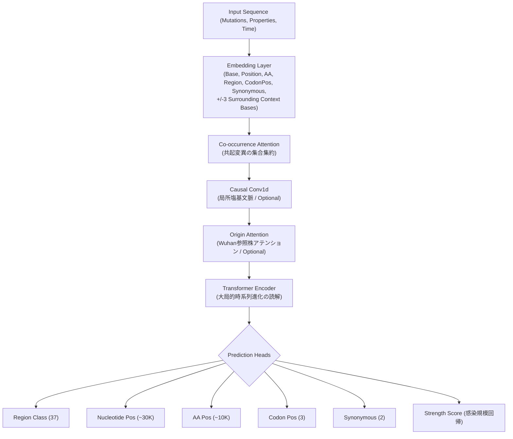

# 🧬 Viral Genome Mutation Prediction Model (v260528)

本プロジェクトは、新型コロナウイルス（SARS-CoV-2）をはじめとするウイルスゲノムの変異発生予測を行う、高度な時系列マルチタスク・ディープラーニングモデル（Hierarchical Transformer）のコードベースです。
変異の時系列的な蓄積ステップ（Mutation Step）と、同時に発生した共起変異の集合を高度にモデル化し、将来のパンデミックを引き起こす変異の早期予測と進化シミュレーションを実現します。

---

## ✨ 主要機能（v260528 搭載機能）

- **共起変異コンテキストの高度化（前後3文字 / 計6塩基特徴量の追加）**
  - 変異が起きた位置の前後3文字（境界外は `'n'`）を新たなカテゴリカル特徴量（15次元特徴量）として追加。
  - `config.py` 内のアブレーションマスクフラグにより、学習中・推論中にこれらの周辺塩基を **1塩基単位で独立して無効化（マスク）** できる高精度アブレーション分析をサポート。
- **高精度マルチタスク学習**
  - 変異の発生する「遺伝子領域（37分類）」、「ゲノム位置（~3万分類）」、「アミノ酸位置（~1万分類）」、「コドン内位置（3分類）」、「同義/非同義（2分類）」、およびその変異株の「流行規模（Strength Score / 回帰）」をマルチタスクで同時に学習・予測。
- **時系列マルチタスクの学習**
  - 変異の時系列ステップ（Mutation Step）に伴う進化の遷移を学習し、未知の時間の経過に合わせて変異発生時期を高度に予測。
- **DuckDB による超高速データベース＆バルク処理**
  - 数百万レコードに及ぶ大規模な変異パスとゲノムメタデータを DuckDB で管理し、メモリ効率的かつ高速なストリームバッチ学習を実現。
- **メンテナンスフリーな動的ロギング**
  - バージョンアップに伴う日付コードの置換漏れを防ぐため、エラーログメッセージ内のパッケージ名を `{__package__}` を用いて自動取得するよう動的化。

---

## 🛠️ Architecture（アーキテクチャ）

同時に発生した共起変異の集合順序への依存性を解消し、位置エンコーディングの矛盾を防ぐための **Co-occurrence Attention (共起集約層)** を中核とする革新的なネットワーク構造です。


```mermaid
graph TD
    Input["Input Sequence (Mutations, Properties, Time)"] --> Embed["Embedding Layer\n(Base, Position, AA, Region, CodonPos, Synonymous,\n+/-3 Surrounding Context Bases)"]
    Embed --> CoAttn["Co-occurrence Attention\n(共起変異の集合集約)"]
    CoAttn --> Conv["Causal Conv1d\n(局所塩基文脈 / Optional)"]
    Conv --> OriAttn["Origin Attention\n(Wuhan参照株アテンション / Optional)"]
    OriAttn --> Transformer["Transformer Encoder\n(大局的時系列進化の読解)"]
    Transformer --> Heads{"Prediction Heads"}
    Heads --> Out1["Region Class (37)"]
    Heads --> Out2["Nucleotide Pos (~30K)"]
    Heads --> Out3["AA Pos (~10K)"]
    Heads --> Out4["Codon Pos (3)"]
    Heads --> Out5["Synonymous (2)"]
    Heads --> Out6["Strength Score (感染規模回帰)"]
```

---

## 🚀 Usage（実行方法）

### 1. 環境構築
本プロジェクトは Linux 上で動作します。Conda 仮想環境等で必要なライブラリ（PyTorch、DuckDB、Pandas 等）をインストールしてください。

### 2. DuckDB データベースの前処理（構築）
前後3塩基特徴量を含んだ高速データベースを構築します。
```bash
# 既存の重い学習プロセスを阻害しないよう、nice で優先度を下げて実行することを推奨
nice -n 19 python -m transformer_260528.preprocess
```

### 3. モデルの学習および評価の実行
```bash
python -m transformer_260528.main
```
実行完了後、`outputs/transformer_260528/results/<timestamp>/` にすべてのログ、学習曲線、集計CSV、および評価プロット画像が自動保存されます。

---

## 📊 Evaluation Metrics（評価指標）

- **Hit Rate（サンプル単位精度）**
  - 各サンプルについて「Top-K予測の中に、実際に発生した共起変異が1つでも含まれるか」を測定。
- **Weighted Recall@1 / Macro Recall@1（クラス単位評価）**
  - クラス不均衡が極めて大きい遺伝子位置予測において、高頻度クラスを重視する Weighted と、稀なクラスも公平に評価する Macro の双方でリコールを測定。
- **流行度カテゴリ（Strength Category）別比較**
  - 変異株の流行規模を `log(1 + sample_count)` スケールで Low（低流行）、Medium（中流行）、High（大流行）の3カテゴリに分類し、カテゴリごとの予測精度を多角的に分析。

---

## 🔬 Ablation Study（アブレーション実験）

`config.py` 内の以下のフラグで各特徴量やニューラルネットワーク層の有効/無効を切り替え、各コンポーネントが予測性能に与える影響度を精密に測定できます。

```python
USE_LOCAL_CONV1D = False         # Conv1d局所特徴抽出の切り替え
USE_ORIGIN_ATTENTION = False     # Origin Attention（武漢株参照）の切り替え

# カテゴリ特徴量・数値特徴量の個別アブレーションマスク（再構築不要で動的適用）
ABLATION_MASKS = {
    'MUTATION_CONTEXT': False,     # 前後3文字（6塩基）を一括無効化
    'MUTATION_CONTEXT_L3': False,  # 3文字前 (P-3) を無効化
    'MUTATION_CONTEXT_L2': False,  # 2文字前 (P-2) を無効化
    'MUTATION_CONTEXT_L1': False,  # 1文字前 (P-1) を無効化
    'MUTATION_CONTEXT_R1': False,  # 1文字後 (P+1) を無効化
    'MUTATION_CONTEXT_R2': False,  # 2文字後 (P+2) を無効化
    'MUTATION_CONTEXT_R3': False,  # 3文字後 (P+3) を無効化

    # 各生化学的数値特徴量の個別マスク
    'FREQ': False,    # 変異発生頻度
    'HYDRO': False,   # 疎水性差
    'CHARGE': False,  # 電荷差
    'SIZE': False,    # サイズ差
    'BLSM': False,    # BLOSUM62スコア差
    'PAM250': False,  # PAM250スコア
    'CODON_LOG_RATIO_DIFF': False,    # コドン対数比差
    'CODON_LOG_RATIO_BEFORE': False,  # 変異前コドン対数比
    'HUMAN_CODON_RSCU_DIFF': False,   # ヒトRSCU差
    'SCV2_CODON_RSCU_DIFF': False,    # SCV2 RSCU差
}
```

---

## 🧬 Baseline Comparison（先行研究 PETra との比較実験）

[PETra](https://github.com/xz-keg/PETra) を含む先行研究に対する本提案アーキテクチャの有効性を科学的に検証するため、リファクタリング済みの同一コードベースを用い、**通常の損失関数（CrossEntropy等）のまま**、以下の3つのモデル構成を同一データセットで対比検証します。

| 比較軸 | モデル①: 先行研究ベース <br>(PETra相当) | モデル②: 中間モデル <br>(直列＋物理化学特徴量) | モデル③: 提案モデル <br>(集約層＋物理化学特徴量) |
| :--- | :---: | :---: | :---: |
| **同時変異（共起）の扱い** | 直列入力 (位置の嘘の時間差) | 直列入力 (位置の嘘の時間差) | **共起変異の集約層 (Co-occurrence Attention)** |
| **生物学的特徴量** | なし (生物学のカンペなし) | **あり** (電荷・疎水性・コドン頻度等) | **あり** (電荷・疎水性・コドン頻度等) |
| **位置エンコーディングの矛盾** | あり (直列順序に依存) | あり (直列順序に依存) | **なし** (集合としての処理により解消) |
| **検証の目的** | PETra相当の基準（Baseline）測定 | 物理化学特徴量による純粋な精度向上効果の証明 | 共起変異集約による本質的なアーキテクチャ効果の証明 |

### 比較実験のポイント
1.  **モデル① 先行研究ベース（直列入力 ＋ 特徴量なし）**:
    同時に発生した変異に対して、便宜的に直列の順序（嘘の時間差）を割り当てて Transformer に入力し、生物学的な特徴量（アミノ酸の電荷差、疎水性差など）を一切与えない構成です。これが先行研究 **PETra** 相当の基準点（Baseline）となります。
2.  **モデル② 中間モデル（直列入力 ＋ 特徴量あり）**:
    モデル①の構成に「電荷・疎水性・アミノ酸変異PAM250スコア・コドン頻度」などの生化学的特徴量を統合。これにより、「生物学的知識（カンペ）」の追加がどれほどダイレクトにモデルの予測精度を押し上げるかを純粋に実証します。
3.  **モデル③ 提案モデル（集約層あり ＋ 特徴量あり）**:
    物理化学特徴量に加え、同時に発生した共起変異を順序に依存せず集合として処理する **「共起アテンション集約層（Co-occurrence Attention）」** を適用。位置エンコーディングの矛盾が解消されることで、単なる特徴量の追加を超えた、アーキテクチャ設計による決定的な精度跳ね上がりを証明します。

---

## 🚀 Future Roadmap（今後の展望）

予測精度のさらなる向上と生物学的妥当性の強化に向け、実装コスト・即効性・重要度を考慮した **3フェーズのロードマップ** に沿って段階的に機能を統合する計画です。

### 📅 Phase 1: 高優先度（Quick Wins & 評価・実運用基盤の確立）
実装コストが極めて低く、かつモデルの実力把握や新規配列データの安全な受容に直結する最優先タスクです。

#### 1. 共起変異数 $R$ に応じた動的評価指標（R-Precision）の追加
- **内容**: 一律の固定値 $K$ (Top-1, Top-5等) ではなく、サンプルごとに実際の変異共起数（ユニークな正解数 $R$）を $K$ とした動的な Top-$R$ 予測精度・再現率を計測する評価機構。
- **効果**: 共起数が $K$ を上回るとRecallが100%に到達できない問題を完全に解消し、モデル本来のカバー能力を正確に可視化します。

#### 2. 基準日ベースの時系列分割（Temporal Split）と時間軸評価（Temporal Evaluation）の統合
- **内容**: `config.py` 内の設定フラグのみで、特定の基準日（例: 2023-12-31）以前を学習データ、以降をテストデータとして自動分割し、評価グラフのX軸を「月別（Year-Month）」などの時間軸に切り替えるスマートなマルチモード評価機構。
- **効果**: 既存の `main.py` などを書き換えることなく、実用的な将来予測能力（時間の経過に伴う予測精度の推移）を安全に検証できるようになります。

#### 3. 系統未分類（Unclassified）サンプルの受容設計（一律 `0.0` フォールバック）
- **内容**: NCBI等の unclassified 株を一律で `"unclassified"` に丸めず、`unclassified_[AccessionID]` として擬似系統名（Pseudo-strain）化して登録することでキャッシュ衝突を防止し、流行度を一律 `0.0`（最小値）に強制設定します。
- **効果**: 流行株のみを用いた学習フィルタから未分類株を安全に除外しつつ、評価時には「超マイナー株」としてシステムを破損させずに学習・検証データに流し込めるようになります。

#### 4. 変異シーケンスの事前学習（MLM/CLM 選択式）
- **内容**: 本プロジェクトの変異データ自体を活用し、双方向の **MLM（Masked Language Modeling）** または単方向の **CLM（Causal Language Modeling）** を config 経由で切り替えて事前学習を回す機構。
- **効果**: 共起関係や時系列推移のドメイン知識をあらかじめ獲得した強力な初期重みを得ることで、下流タスクのファインチューニング精度を極限まで高めます。

#### 5. 予測ターゲット間関係の自己回帰デコーダー（極小Decoder / アプローチB）
- **内容**: 各マルチタスク予測ヘッド（Region, Pos, AA, CodonPos 等）の手前に非常にコンパクトな自己回帰デコーダー層を組み込みます。
- **効果**: 「変異位置決定 ➔ アミノ酸変異/コドン変異の決定」のように、出力ラベル間の依存関係を条件付き確率（自己回帰）で結合し、遺伝暗号表に則った生物学的に矛盾のない一貫した予測結果を実現します。

#### 6. 予測対象（ターゲット）の拡張：具体的な塩基置換・アミノ酸置換の直接予測
- **内容**: 変異が発生する位置情報だけでなく、具体的に「どの文字からどの文字へ変化したか」という遷移確率（4x4の塩基置換、および20x20のアミノ酸置換）自体を直接予測するヘッドを追加します。
- **効果**: 変異の「発生位置」と「置換内容」の双方を完全予測可能とし、進化シミュレータとしての実用性を飛躍的に高めます。

#### 7. UShERの `clades.txt` を用いた真の系統ベースの流行度集計
- **内容**: メタデータの Lineage テキスト集計ではなく、UShERの系統樹トポロジー placements が出力する `clades.txt` を直接パースして系統別のサンプル数を集計する機構。
- **効果**: NCBI上で `unclassified` なサンプルであっても、ゲノム配列的に極めて近い親系統の一部として自動的にカウントされるため、人為的な名前の有無に左右されず、ゲノムの近縁関係に基づいた真のウイルス集団の流行動態を学習可能にします。

---

### 📅 Phase 2: 中優先度（生物学的ドメイン知識の統合）
アミノ酸の立体構造や進化的特性といった「生物学的カンペ」を明示的に与え、予測タスクの表現力を格段に引き上げるコア開発フェーズです。

#### 8. 事前学習済みPLM（Protein Language Model：ESM-2）の統合（アプローチA）
- **内容**: 軽量な **ESM-2**（例: `esm2_t6_8M_UR50D`）を用い、変異位置の周辺30〜50アミノ酸の局所配列から文脈依存の表現（Embedding）ベクトルを抽出。これを既存の `combined` 特徴量に結合します。
- **効果**: タンパク質の3次元立体構造や進化的な変異許容度（保存度）といった数億規模の事前知識を、モデル構造を大きく変えることなく安全かつ低コストに既存パイプラインへ注入できます。

#### 9. 立体構造特性（3D座標・SASA・B-factor）の明示的特徴量の統合
- **内容**: Spike等のAlphaFold/PDB構造情報から、変異位置の **SASA（溶媒露出表面積：表面か内部か）** や **B-factor（分子のゆらぎ）**、立体中心からの距離等を直接数値特徴量としてマージします。
- **効果**: AIが塩基置換から間接的に立体構造変化を推測する学習負担を排除し、構造依存の予測性能を極限まで高めます。

#### 10. ウイルスの進化適応度・免疫逃避能（先行研究 EVEscape）の統合
- **内容**: 著名なゼロショット進化適合度モデル **EVEscape** のスコアリングロジック、あるいは変異ごとのEVEscape予測スコア自体を新たな数値特徴量としてマージします。
- **効果**: 「生化学的に発生しやすい変異（塩基置換特性）」と「環境下で生存・免疫逃避しやすい変異（Fitness）」の両面から多角的に将来変異をシミュレーションできるようになります。

---

### 📅 Phase 3: 将来優先度（先端深層学習パラダイムの適用 & 極限の汎化）
基本アーキテクチャの完成後、予測の限界を突破し、未知のパンデミックや別ウイルスに適用するための高度なスケーラビリティ検証フェーズです。

#### 11. 変異段階（Mutation Step）＆共起数に基づくカリキュラム学習
- **内容**: 初期フェーズでは単純な変異（変異段階が短く共起が1）から学習し、徐々に難易度（多重共起や長い変異段階）を上げていく段階的学習機構。
- **効果**: 基本的な変異しやすい位置（位置バイアス）を定着させてから高度な共起関係を学ばせるため、収束を劇的に助け、不必要な過学習を効果的に防ぎます。

#### 12. 教師あり対照学習（SupCon）による構造化表現学習
- **内容**: 同一系統や同一流行度のシーケンスを引き合わせ、異なる特性のシーケンスを引き離す対照損失（SupCon Loss）による表現学習。
- **効果**: モデルがウイルスの系統樹トポロジーや進化マップを高次元空間に美しく構造化して記憶できるようになり、未知の系統や出現初期の変異株に対する汎化性能を飛躍的に高めます。

#### 13. 時系列＆アーキテクチャのマルチビュー・アンサンブル
- **内容**: 異なる基準日（時間窓）で学習させたモデルや、局所文脈抽出の有無（Local/Global）が異なる異種モデルをブレンディング（重み付き平均）して予測するアンサンブル機構。
- **効果**: 将来の進化トレンドシフトに対する極めて頑健な予測と、予測確率の最終安定化を達成します。

#### 14. 他ウイルスへの汎化検証（先行研究 PETra を踏まえたマルチバイラル展開）
- **内容**: COVID-19で確立した本構成を、インフルエンザ（Influenza）などデータ豊富な他ウイルスのゲノムデータセットに適用し、先行研究 **PETra** が掲げた予測モデルのマルチバイラルな汎用性を検証します。

---

※ 上記のすべての追加・高度化機能は、`config.py` 上のフラグによりワンタッチで有効/無効の切り替えが可能な設計とします。

---

## 📝 License

[MIT License / Research Use Only]

---

**Author:** Takeru Aiba