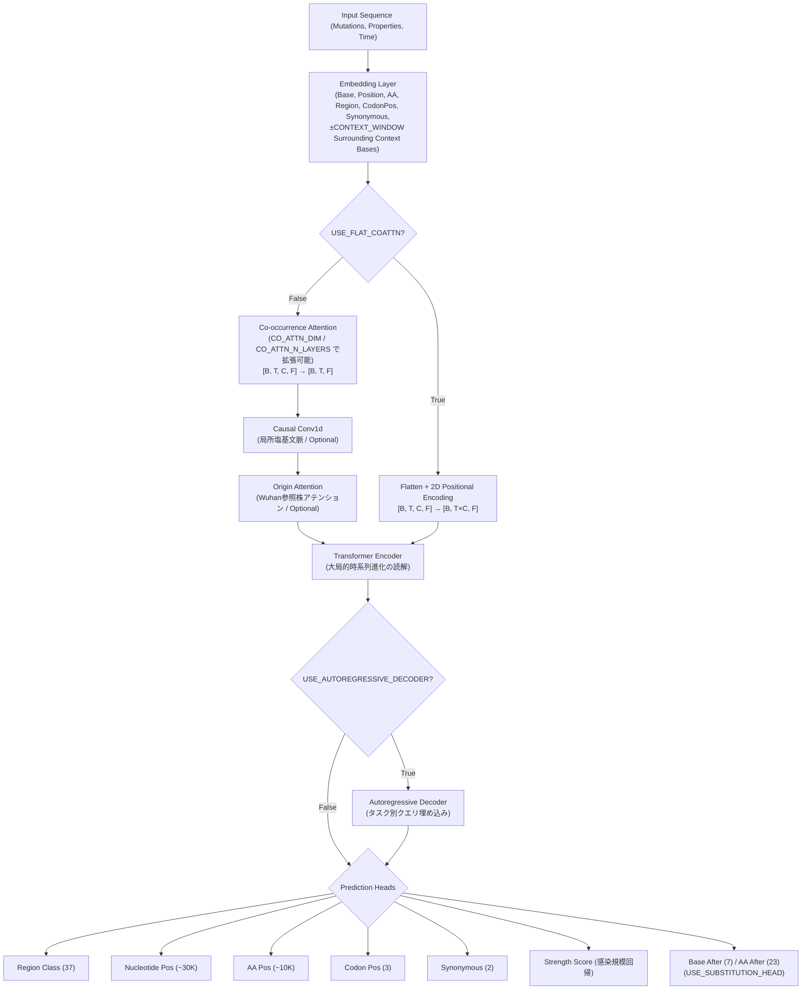
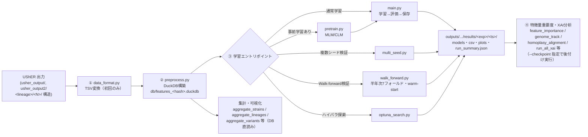

# 🧬 Viral Genome Mutation Prediction Model (v260707)

本プロジェクトは、新型コロナウイルス（SARS-CoV-2）をはじめとするウイルスゲノムの変異発生予測を行う、高度な時系列マルチタスク・ディープラーニングモデル（Hierarchical Transformer）のコードベースです。
変異の時系列的な蓄積ステップ（Mutation Step）と、同時に発生した共起変異の集合を高度にモデル化し、将来のパンデミックを引き起こす変異の早期予測と進化シミュレーションを実現します。

---

## ✨ 主要機能（v260707 搭載機能）

- **NCBI/UShERダブル系統名・流行度システムの統合（動的切り替え）**
  - 配列メタデータ上の系統名（NCBI）と、系統樹トポロジー上の placements から得られる系統名（UShER）の双方をDBに抽出し、保持・表示。
  - UShERの `clades.txt` からNextclade名（Clade最頻値）およびサンプル数を自動集計する機構を導入。
  - `config.STRENGTH_SOURCE` の切り替え（`'ncbi'` / `'usher'`) だけで、モデル学習や評価時に参照する系統名・流行度を動的に切り替え可能。

- **追加Usher出力ディレクトリ・追加サンプル一覧CSVの取り込み**
  - `config.DATA_BASE_DIR`（デフォルト `../usher_output/`）に加え、`config.EXTRA_DATA_BASE_DIRS`（リスト）で同一の `<lineage>/<N>/` 構造を持つ追加のUsher出力ディレクトリを取り込める。`scripts/preprocess/data_format.py` と `preprocess.py` は両方とも自動的に全ディレクトリを横断して処理する（`--base-dir` 指定時は1ディレクトリのみに限定可能）。
  - 対応する追加サンプル一覧は `config.EXTRA_SEQUENCES_CSV`（リスト）で指定し、`SEQUENCES_CSV` と同一スキーマ前提で結合ロードされる。
  - 現行設定: `EXTRA_DATA_BASE_DIRS = ['../usher_output2/']` / `EXTRA_SEQUENCES_CSV = ['reference/sequences-241017_2.csv']`。

- **ホスト適応特徴量の統合（24次元）**
  - `reference/codon/SCV2_host_adaptation_features.csv` に集約された24種類のコドン組成ベース特徴量を数値入力に追加。
  - ヒト・SCV2 の RSCU・コドン頻度・CAI（相対的適応度）の変異前後の値と差分、コドン最適性フラグ（optimal_to_optimal 等）、トランジション/トランスバージョン、CpG/UpA ジヌクレオチド変化量、宿主距離対数比などを網羅。
  - `reference/codon/generate_host_adaptation_features.py` で再生成可能。

- **パス内累積変異カウント特徴量の追加**
  - 入力パスにおけるシノニマス変異・ノンシノニマス変異それぞれの累積カウントを数値特徴量（`cum_syn`/`cum_nonsyn`）として追加。
  - 各タイムステップ開始前の累積値を渡すため、同一タイムステップ内の共起変異は全て同じ値を参照する。

- **亜系統の流行ダイナミクス特徴（4次元・因果的な適応度代理）**
  - 各サンプル（亜系統 × 収集日）に、**収集日以前のデータだけ**で計算した4つの成長特徴を数値入力に追加（`USE_LINEAGE_GROWTH_FEATURES`）。適応度は「どの変異が出現・拡大するか」を駆動するため、位置予測の文脈情報になる。
  - `lineage_log_count_recent`（規模の因果版）/ `lineage_growth_rate`（直近K週の log件数の傾き＝勢い、正=拡大・負=縮小）/ `lineage_rel_growth_adv`（logit シェアの傾き＝共流行系統に対する**相対成長優位＝logistic fitness**）/ `lineage_growth_accel`（加速度＝ピークアウト検知）。
  - epidemic 件数は系列メタCSV（`Pangolin` × `Collection_Date`）から週次で構築（`db/growth_features.py`）。系統粒度は Pango 上位2階層。「縮小期の件数」等の**未来量は使わずリークを防止**し、位相は `growth_rate` の符号で表現する。
  - 有効化すると `NUM_CHEM_FEATURES` が 32→36 に増え **DB 再構築が必要**。効果は permutation importance／ablation／walk-forward で検証する（既存 `strength` との冗長性・リークの有無を確認）。

- **前後コンテキスト塩基の窓幅拡張（`CONTEXT_WINDOW` で制御）**
  - 変異位置の前後塩基を `config.CONTEXT_WINDOW`（デフォルト ±5）で動的に制御。±3/±5/±7 を config の変更だけで切り替え可能。
  - カテゴリ特徴量 = 9（固定）+ 2×CONTEXT_WINDOW（コンテキスト）。
  - アブレーションマスクも `MUTATION_CONTEXT_L1`〜`L7` / `R1`〜`R7` で1塩基単位の個別制御に対応。

- **高精度マルチタスク学習**
  - 変異の発生する「遺伝子領域（37分類）」、「ゲノム位置（~3万分類）」、「アミノ酸位置（~1万分類）」、「コドン内位置（3分類）」、「同義/非同義（2分類）」、「塩基変化先（7分類）」、「アミノ酸変化先（23分類）」、およびその変異株の「流行規模（Strength Score / 回帰）」をマルチタスクで同時に学習・予測。

- **時系列マルチタスクの学習**
  - 変異の時系列ステップ（Mutation Step）に伴う進化の遷移を学習し、未知の時間の経過に合わせて変異発生時期を高度に予測。

- **Co-occurrence Attention の多段階拡張（Omicron期大規模共起への対応）**
  - `CO_ATTN_DIM`（内部次元拡大）、`CO_ATTN_N_LAYERS`（変異間 Self-Attention の多段化）、`USE_FLAT_COATTN`（全変異を独立トークンとして Transformer に直接入力）の3フラグで共起集約の表現力をアブレーション比較可能。

- **DuckDB による超高速データベース＆バルク処理**
  - 数百万レコードに及ぶ大規模な変異パスとゲノムメタデータを DuckDB で管理し、メモリ効率的かつ高速なストリームバッチ学習を実現。

- **多角的な評価・出力システム**
  - 感染規模9区分（〜100/〜500/〜1K/〜5K/〜10K/〜50K/〜100K/〜500K/>500K）の精度ファイル分割。
  - 系統（Pango 上位2階層）単位でのHitRate・予測難易度エントロピーを集計した `{prefix}_lineage_metrics.csv` を常時出力。
  - 実験横断スクリプト比較のための `run_summary.json`（主要指標を軽量JSONで保存）。
  - `USE_R_PRECISION=True` 時の R-Precision 結果を独立ファイル `{prefix}_r_precision.csv` に保存。

- **メンテナンスフリーな動的ロギング**
  - バージョンアップに伴う日付コードの置換漏れを防ぐため、エラーログメッセージ内のパッケージ名を `{__package__}` を用いて自動取得するよう動的化。

- **実験ハーネス・高速化・分析ツール（v260707 拡張）**
  - **マルチシード検証**（mean±std 集計）・**Walk-forward 検証**（半年次7フォールド）・**Optuna ハイパラ探索**（オフライン SQLite・pruning）の3ハーネス。
  - **DataLoader 並列化**によるデータ律速の解消（実測 ~2.0x）、**プロット出力の個別トグル**、**早期終了の hit-rate 対応**。
  - **特徴量重要度**（Permutation＝精度寄与 / Gradient×Input＝感度）に加え、**生物学的 XAI スイート**（ゲノムトラック／ホモプラシー整合／コンステレーション復元／Integrated Gradients 局所説明／表現プロービング）を単独スクリプトで提供。`run_all_xai` で一括実行可。
  - 詳細は「⚙️ 学習設定・実験ハーネス・高速化」節および「🚀 Usage → 6. 特徴量重要度・生物学的 XAI 分析」を参照。

---

## 🛠️ Architecture（アーキテクチャ）

同時に発生した共起変異の集合順序への依存性を解消し、位置エンコーディングの矛盾を防ぐための **Co-occurrence Attention (共起集約層)** を中核とする革新的なネットワーク構造です。


```mermaid
graph TD
    Input["Input Sequence (Mutations, Properties, Time)"] --> Embed["Embedding Layer\n(Base, Position, AA, Region, CodonPos, Synonymous,\n±CONTEXT_WINDOW Surrounding Context Bases)"]

    Embed --> FlatSwitch{USE_FLAT_COATTN?}
    FlatSwitch -->|False| CoAttn["Co-occurrence Attention\n(CO_ATTN_DIM / CO_ATTN_N_LAYERS で拡張可能)\n[B, T, C, F] → [B, T, F]"]
    FlatSwitch -->|True| FlatSeq["Flatten + 2D Positional Encoding\n[B, T, C, F] → [B, T×C, F]"]

    CoAttn --> Conv["Causal Conv1d\n(局所塩基文脈 / Optional)"]
    Conv --> OriAttn["Origin Attention\n(Wuhan参照株アテンション / Optional)"]
    OriAttn --> Transformer

    FlatSeq --> Transformer["Transformer Encoder\n(大局的時系列進化の読解)"]

    Transformer --> ARSwitch{USE_AUTOREGRESSIVE_DECODER?}
    ARSwitch -->|False| Heads{"Prediction Heads"}
    ARSwitch -->|True| ARDec["Autoregressive Decoder\n(タスク別クエリ埋め込み)"]
    ARDec --> Heads

    Heads --> Out1["Region Class (37)"]
    Heads --> Out2["Nucleotide Pos (~30K)"]
    Heads --> Out3["AA Pos (~10K)"]
    Heads --> Out4["Codon Pos (3)"]
    Heads --> Out5["Synonymous (2)"]
    Heads --> Out6["Strength Score (感染規模回帰)"]
    Heads --> Out7["Base After (7) / AA After (23)\n(USE_SUBSTITUTION_HEAD)"]
```

### 入力特徴量

| 種別 | 次元数 | 内容 |
|---|---|---|
| カテゴリ特徴量 | `9 + 2×CONTEXT_WINDOW` | base_before, position, base_after, codon_pos, aa_before, aa_pos, aa_after, region, synonymous, 前後コンテキスト塩基 |
| 数値特徴量 | 32（+4） | 物理化学6 + ホスト適応24 + 累積変異カウント2（+ 亜系統成長4：`USE_LINEAGE_GROWTH_FEATURES=True` で計36） |

### シーケンスデータ
#### condition
##### reference/sequences-241017.csv (2024/10/18) — `config.SEQUENCES_CSV`
Virus/Taxonomy:Severe acute respiratory syndrome coronavirus 2, taxid:2697049
Sequence Length min:29000 max:30000
Host:Homo sapiens (human), taxid:9606
Release Date: From Jan 1, 2020 To Oct 18, 2024
number : 8,938,263

##### reference/sequences-241017_2.csv (2026/07/10) — `config.EXTRA_SEQUENCES_CSV[0]`（`usher_output2/` に対応）
Virus/Taxonomy:Severe acute respiratory syndrome coronavirus 2, taxid:2697049
Sequence Length min:29000 max:30000
Host:Homo sapiens (human), taxid:9606
Release Date: From Oct 18, 2024 To Jul 10, 2026
Collection Date: From Jan 1, 2020 To Oct 18, 2024
number : 8,938,263

---

## 🔄 実行フロー（パイプライン全体像）

生データから学習・評価・分析までの流れ。各ステップの具体的なコマンドは次の「🚀 Usage」節を参照。


```mermaid
graph LR
    A["UShER 出力\n(usher_output/, usher_output2/\n&lt;lineage&gt;/&lt;N&gt;/ 構造)"] --> B["① data_format.py\nTSV変換（初回のみ）"]
    B --> C["② preprocess.py\nDuckDB構築\ndb/features_&lt;hash&gt;.duckdb"]

    C --> D{"③ 学習エントリポイント"}
    D -->|通常学習| E["main.py\n学習→評価→保存"]
    D -->|事前学習あり| P["pretrain.py\nMLM/CLM"] --> E
    D -->|複数シード検証| MS["multi_seed.py"]
    D -->|Walk-forward検証| WF["walk_forward.py\n半年次7フォールド・warm-start"]
    D -->|ハイパラ探索| OP["optuna_search.py"]

    E --> R["outputs/.../results/&lt;exp&gt;/&lt;ts&gt;/\nmodels・csv・plots・run_summary.json"]
    MS --> R
    WF --> R
    OP --> R

    R --> X["④ 特徴量重要度・XAI分析\nfeature_importance / genome_track /\nhomoplasy_alignment / run_all_xai 等\n（--checkpoint 指定で後付け実行）"]
    C --> AG["集計・可視化\naggregate_strains / aggregate_lineages /\naggregate_variants 等（DB直読み）"]
```

- **① データ変換**: `EXTRA_DATA_BASE_DIRS` を含む全 UShER 出力ディレクトリを横断して TSV へ変換。初回のみ実行。
- **② 前処理**: 特徴量設定（`NUM_CHEM_FEATURES`・`CONTEXT_WINDOW`・`ABLATION_MASKS` 等）のハッシュで DB ファイル名が決まるため、設定が同じなら既存 DB を再利用でき、再前処理は不要。
- **③ 学習**: `main.py` が標準の学習→評価フロー。用途に応じて事前学習（MLM/CLM）を前段に挟む、または `multi_seed` / `walk_forward` / `optuna_search` のいずれかのハーネスから起動する（内部的には同じ train/evaluate ロジックを共有）。
- **④ 事後分析**: 学習済み `best_model.pth` を `--checkpoint` に渡す独立 CLI 群。学習を再実行せず何度でも呼び出せる。集計・可視化スクリプトは DB を直接読むため学習不要。

---

## 🚀 Usage（実行方法）

### 1. 環境構築

```bash
# conda 環境を新規作成（初回のみ）
conda env create -f environment.yml

# または pip で依存パッケージをインストール
pip install -r requirements.txt
pip3 install torch torchvision

# 環境を有効化
conda activate gvp25-05
```

### 2. UShER 出力の変換（初回のみ）
```bash
# config.DATA_BASE_DIR + config.EXTRA_DATA_BASE_DIRS を自動で全て処理する
python -m transformer_260707.scripts.preprocess.data_format

# 1ディレクトリのみに限定したい場合は --base-dir を指定
python -m transformer_260707.scripts.preprocess.data_format --base-dir ../usher_output2/
```

### 3. DuckDB データベースの前処理（初回 or DB 再構築時）
```bash
nice -n 19 python -m transformer_260707.preprocess
```
`config.py` の `NUM_CHEM_FEATURES`・`CONTEXT_WINDOW`・`ABLATION_MASKS` が変更されると、設定ハッシュが自動的に変わり次回実行時に DB が再構築される。

### 4. モデルの学習および評価の実行
```bash
nohup python -m transformer_260707.main > nohup0.out 2>&1 &
tail -f nohup0.out
```
実行完了後、`outputs/transformer_260707/results/<EXPERIMENT_NAME>/<timestamp>/` にすべてのログ、学習曲線、集計CSV、および評価プロット画像が自動保存される。

### 5. 実験ハーネス（複数シード検証・ハイパラ探索）
```bash
# 複数シードで学習→評価し、主要指標を mean±std に集計（single run のノイズ判定用）
python -m transformer_260707.scripts.eval.multi_seed --seeds 42 1 7
#   → results/multi_seed/<ts>/multi_seed_summary.json（aggregate に mean/std/values）

# 半年次 Walk-forward 検証（全7フォールド。config.SPLIT_MODE を触らず起動可）
nohup python -m transformer_260707.scripts.eval.walk_forward > nohup_wf.out 2>&1 &
python -m transformer_260707.scripts.eval.walk_forward --folds 2 6   # 特定フォールドのみ

# Optuna ハイパラ探索（ローカル SQLite 保存＝オフライン・中断再開可、pruning つき）
pip install optuna   # 未導入の場合
python -m transformer_260707.scripts.eval.optuna_search --n-trials 15 --params lr loss_weights
#   → outputs/.../scripts/optuna/<study>.db（全 trial 履歴）, <study>_best.json（ベスト構成）
```
> **探索コストの目安**: 1 trial = 1 学習（実測 1 epoch ≈ 40〜70 分）。フル 15 epoch × 多 trial は数日規模になるため、探索は短 epoch・少 trial（＋pruning）で回し、上位構成のみ multi-seed / walk-forward でフル検証する二段構えを推奨。

### 6. 特徴量重要度・生物学的 XAI 分析
学習済みチェックポイントに対する後付け分析。すべて単独 CLI（`--checkpoint` 指定、`--force_cpu` 対応）で、共通基盤 `scripts/analysis/_xai_common.py`（config_snapshot 反映・モデル/ローダ・出力保存を集約）の上に載る。

```bash
# 特徴量重要度（数値特徴32/36次元）
python -m transformer_260707.scripts.analysis.feature_importance --checkpoint <best.pth>        # Gradient×Input（感度）＋埋め込みノルム＋Co-Attn重み
python -m transformer_260707.scripts.analysis.permutation_importance --checkpoint <best.pth> \
    --metric position_hit_rate --n_batches 50 --n_repeats 2                                      # 精度寄与（再学習不要）

# 生物学的 XAI（位置→遺伝子 annotation・外部データと突き合わせ）
python -m transformer_260707.scripts.analysis.genome_track --checkpoint <best.pth>               # ①位置/遺伝子別の予測質量 → ゲノム地図
python -m transformer_260707.scripts.analysis.homoplasy_alignment --checkpoint <best.pth>        # ②重要度 vs homoplasy 相関＋problematic 負コントロール
python -m transformer_260707.scripts.analysis.cooccurrence_constellation --checkpoint <best.pth> # ③共予測ペア vs 実共起（変異株コンステレーション復元）
python -m transformer_260707.scripts.analysis.local_explain --checkpoint <best.pth>              # ④Integrated Gradients による1予測の局所説明
python -m transformer_260707.scripts.analysis.probe_representation --checkpoint <best.pth>       # ⑤内部表現の線形プロービング（gene/Spike/同義 を復元できるか）

# ↑の新規5本を一括実行（出力を xai_all/<ts>/<analysis>/ に集約、失敗継続）
python -m transformer_260707.scripts.analysis.run_all_xai --checkpoint <best.pth> --split test
#   --only / --skip で対象選択、--n_batches で共通上書き、--force_cpu、--dry_run（コマンド確認のみ）
```

| 分析 | 何を見るか | 主な外部データ |
|---|---|---|
| `genome_track` | モデルが Spike/RdRp 等の意味ある領域に注目しているか | `codon_mutation4.csv`（遺伝子annotation） |
| `homoplasy_alignment` | 重要部位が**正の選択下の収斂部位**と一致するか／アーチファクト部位を回避しているか | `homoplasy/site_recurrence.csv`, `problematic_sites…vcf` |
| `cooccurrence_constellation` | 既知ハプロタイプ（連鎖・エピスタシス）を再発見しているか | — |
| `local_explain` | 個々の予測を「どの過去変異・特徴が押し上げたか」に帰属 | — |
| `probe_representation` | 内部表現に生物概念（遺伝子/Spike/同義）が符号化されているか | — |

### ユーティリティ
```bash
python -m transformer_260707.scripts.inspect.inspect_duckdb    # DB スキーマ確認
python -m transformer_260707.scripts.inspect.view_one_sample   # サンプル内容確認（数値特徴量を表示。成長特徴有効時は36次元）
python -m transformer_260707.scripts.analysis.aggregate_strains    # 株別集計
python -m transformer_260707.scripts.analysis.aggregate_lineages   # 系統別集計
python -m transformer_260707.scripts.analysis.aggregate_variants   # 月別変異株集計
```

---

## 📊 Evaluation Metrics（評価指標）

- **Hit Rate（サンプル単位精度）**
  - 各サンプルについて「Top-K予測の中に、実際に発生した共起変異が1つでも含まれるか」を測定。

- **Weighted Recall@1 / Macro Recall@1（クラス単位評価）**
  - クラス不均衡が極めて大きい遺伝子位置予測において、高頻度クラスを重視する Weighted と、稀なクラスも公平に評価する Macro の双方でリコールを測定。

- **感染規模カテゴリ別精度**
  - `log(1 + sample_count)` スケールで **Low/Medium/High の3区分** と **9区分の細分化**（〜100/〜500/〜1K/〜5K/〜10K/〜50K/〜100K/〜500K/>500K）でカテゴリ別精度を保存。
  - `config.SAVE_STRAIN_METRICS = True` で株単位の `{prefix}_strain_metrics.csv` も出力可能。

- **系統別精度・予測難易度（`{prefix}_lineage_metrics.csv`）**
  - Pango lineage の上位2階層（例: BA.2, XBB.1）でグループ化。
  - 各系統のHitRateに加え、ターゲット変異位置分布のエントロピー（予測難易度）を集計。

- **R-Precision（`{prefix}_r_precision.csv`）**
  - `USE_R_PRECISION=True` 時、各サンプルの実際の共起変異数 $R$ を $K$ とした動的 Top-$R$ 評価結果を独立ファイルに保存。

- **run_summary.json**
  - 実験ごとに HitRate@K・Macro Recall・Val/Test Loss を1ファイルにまとめた軽量JSON。

---

## 📚 詳細ドキュメント

本 README は概要・アーキテクチャ・実行方法に絞っています。詳細な研究ノート・提案・履歴は以下を参照してください。

- [docs/analysis.md](docs/analysis.md) — 精度特性の分析・根本課題・改善の方向性
- [docs/roadmap.md](docs/roadmap.md) — 今後の展望（未実装の提案一覧）
- [docs/changelog.md](docs/changelog.md) — 既知の不具合・修正履歴

---

## 🔍 精度特性の分析と根本課題

Omicron 出現期以降の精度低下・ターゲットエントロピー爆発という根本原因の分析、および改善の方向性（評価指標の転換／エントロピーフィルタリング／階層的予測／系統埋め込み等）と、ラベル多義性そのものを扱う発展的提案（6〜12）は分量が大きいため別ドキュメントに分離しました。

**→ 詳細は [docs/analysis.md](docs/analysis.md) を参照。**

---

## 🔬 Ablation Study（アブレーション実験）

`config.py` 内の以下のフラグで各特徴量やニューラルネットワーク層の有効/無効を切り替え、各コンポーネントが予測性能に与える影響度を精密に測定できます。

```python
USE_LOCAL_CONV1D = False         # Conv1d局所特徴抽出の切り替え
USE_ORIGIN_ATTENTION = False     # Origin Attention（武漢株参照）の切り替え

# Co-occurrence Attention 拡張（共起集約の表現力比較）
CO_ATTN_N_HEADS  = 4            # 共起 Attention のヘッド数
CO_ATTN_N_LAYERS = 1            # 2以上で変異間 Self-Attention を多段化
CO_ATTN_DIM      = 256          # 内部次元
USE_FLAT_COATTN  = False        # True: 全変異を独立トークンとして Transformer に渡す

# コンテキスト窓幅（再前処理が必要）
CONTEXT_WINDOW = 5              # 前後各方向の塩基数。3 / 5 / 7 で切り替え

# 数値・カテゴリ特徴量の個別アブレーションマスク（再前処理不要・動的適用）
ABLATION_MASKS = {
    # --- 物理化学的特徴量 (num[0..5]) ---
    'FREQ': False,    # 変異発生頻度
    'HYDRO': False,   # 疎水性差
    'CHARGE': False,  # 電荷差
    'SIZE': False,    # サイズ差
    'BLSM': False,    # BLOSUM62スコア差
    'PAM250': False,  # PAM250スコア

    # --- ホスト適応特徴量 (num[6..29]) ---
    'HOST_LOG_RATIO_DIFF': False,         # 宿主距離対数比差分
    'HOST_LOG_RATIO_BEFORE': False,       # 変異前宿主距離対数比
    'HUMAN_RSCU_DIFF': False,             # ヒトRSCU差
    'SCV2_RSCU_DIFF': False,              # SCV2 RSCU差
    'OPTIMAL_TO_OPTIMAL': False,          # 最適→最適コドン変化フラグ
    'NON_OPTIMAL_TO_OPTIMAL': False,      # 非最適→最適コドン変化フラグ
    'OPTIMAL_TO_NON_OPTIMAL': False,      # 最適→非最適コドン変化フラグ
    'IS_TRANSITION': False,               # トランジション/トランスバージョン
    'TRANSITION_HUMAN_RSCU_DIFF': False,  # トランジション×ヒトRSCU差
    'TRANSITION_SCV2_RSCU_DIFF': False,   # トランジション×SCV2 RSCU差
    'CPG_DIFF': False,                    # CpGジヌクレオチド変化量
    'UPA_DIFF': False,                    # UpAジヌクレオチド変化量
    'HUMAN_RSCU_BEFORE': False,           # 変異前ヒトRSCU
    'SCV2_RSCU_BEFORE': False,            # 変異前SCV2 RSCU
    'HUMAN_FREQ_BEFORE': False,           # 変異前ヒトコドン頻度
    'HUMAN_FREQ_DIFF': False,             # ヒトコドン頻度差分
    'SCV2_FREQ_BEFORE': False,            # 変異前SCV2コドン頻度
    'SCV2_FREQ_DIFF': False,              # SCV2コドン頻度差分
    'HUMAN_CAI_BEFORE': False,            # 変異前ヒトCAI
    'HUMAN_CAI_DIFF': False,              # ヒトCAI差分
    'SCV2_CAI_BEFORE': False,             # 変異前SCV2 CAI
    'SCV2_CAI_DIFF': False,               # SCV2 CAI差分
    'HOST_RSCU_RATIO_BEFORE': False,      # 変異前宿主RSCU比
    'HOST_RSCU_RATIO_DIFF': False,        # 宿主RSCU比差分

    # --- 累積変異カウント (num[30..31]) ---
    'CUM_SYN': False,    # パス内シノニマス変異累積数
    'CUM_NONSYN': False, # パス内ノンシノニマス変異累積数

    # --- 亜系統の流行ダイナミクス (num[32..35]、USE_LINEAGE_GROWTH_FEATURES=True 時) ---
    'LINEAGE_LOG_COUNT_RECENT': False,  # 直近K週件数（規模）
    'LINEAGE_GROWTH_RATE': False,       # log件数の傾き（勢い）
    'LINEAGE_REL_GROWTH_ADV': False,    # logitシェアの傾き（相対成長優位）
    'LINEAGE_GROWTH_ACCEL': False,      # growth_rate の加速度

    # --- 前後塩基コンテキスト（CONTEXT_WINDOW 分まで個別制御可）---
    'MUTATION_CONTEXT': False,     # 全コンテキスト塩基を一括無効化
    'MUTATION_CONTEXT_L1': False,  # 1文字前 (P-1)
    'MUTATION_CONTEXT_L2': False,  # 2文字前 (P-2)
    'MUTATION_CONTEXT_L3': False,  # 3文字前 (P-3)
    'MUTATION_CONTEXT_L4': False,  # 4文字前 (P-4)
    'MUTATION_CONTEXT_L5': False,  # 5文字前 (P-5)
    'MUTATION_CONTEXT_R1': False,  # 1文字後 (P+1)
    'MUTATION_CONTEXT_R2': False,  # 2文字後 (P+2)
    'MUTATION_CONTEXT_R3': False,  # 3文字後 (P+3)
    'MUTATION_CONTEXT_R4': False,  # 4文字後 (P+4)
    'MUTATION_CONTEXT_R5': False,  # 5文字後 (P+5)
}
```

---

## ⚙️ 学習設定・実験ハーネス・高速化（v260707 で拡張）

### 早期終了の対象メトリクス（hit-rate 対応）
`val_loss` は hit-rate と乖離することがある（例: MLM 事前学習は hit-rate を上げるが loss は悪化）ため、**実際の評価指標で checkpoint を選べる**よう早期終了の対象を切り替え可能。

```python
# config.py
EARLY_STOPPING_METRIC = 'val_position_hit_rate'  # 'val_<task>_<指標>' 形式
EARLY_STOPPING_MODE   = 'max'                     # hit-rate 系は 'max'
# task  = region / position / aa_pos / codon_pos / synonymous
# 指標  = hit_rate / macro_recall / weighted_recall / f1 / precision / recall
#   （これらは per-epoch の evaluate() が算出。top-k / r_precision は最終評価のみで対象外）
#   存在しないキーは WARNING を出して val_loss にフォールバック（checkpoint 未保存事故を防止）
```

### DataLoader 並列化（学習高速化）
学習は GPU 計算ではなく **DuckDB ストリーミング＋per-sample の Python 処理が律速**（バッチサイズを変えても学習時間が変わらないのはこのため）。ワーカーを増やしてデータ前処理を GPU 計算とオーバーラップさせると時短できる。**ストリーミング設計は維持されメモリはデータ量に比例しない**（増分はワーカー数ぶんの固定分のみ）。

```python
# config.py
NUM_DATALOADER_WORKERS        = 8      # 0=同期（従来）。実測で 8 が ~2.0x（4 は ~1.3x, 28コア環境）
DATALOADER_PREFETCH_FACTOR    = 2
DATALOADER_PERSISTENT_WORKERS = True
DATALOADER_PIN_MEMORY         = True
DATALOADER_DUCKDB_THREADS     = None  # ワーカー内は自動で 2（スレッド張りすぎ＝オーバーサブスクライブ防止）
```
`DBIterableDataset` はワーカーごとに `sample_ids` をストライド分割（sharding）し、データ重複なく並列化する。

### プロット出力の個別トグル
各評価プロットを個別に出力/抑制できる（重い可視化を切って高速化）。`config.PLOT_OUTPUTS`（25キーの dict、キー無し/True=出力＝従来動作）。

### 系統別の予測難易度プロット（3種：エントロピー代替を含む）
「系統ごとのターゲット位置の分散度」と position hit-rate の関係を、横軸を変えた3図で可視化する。分散が大きい系統ほど次変異の候補が広く、予測が難しい。

| プロット | 横軸（分散度指標） | 解釈 | 出力ファイル |
|---|---|---|---|
| `entropy_vs_accuracy` | 正規化エントロピー | 情報理論指標 | `{prefix}_entropy_vs_accuracy.png` |
| `labeldiversity_vs_accuracy` | **ユニーク率**（ユニーク位置数 / 全位置出現数） | 「ターゲットの何割が異なる位置か」。素朴だがサンプル数が多い系統ほど低く出る傾向 | `{prefix}_labeldiversity_vs_accuracy.png` |
| `simpson_vs_accuracy` | **Gini–Simpson 多様度** D=1−Σpᵢ² | 「無作為に2つ選んで別位置になる確率」。生態学標準の生物多様度指数で**生物系に説明不要**・サンプル数バイアスに強い | `{prefix}_diversity_simpson_vs_accuracy.png` |

いずれも 0→集中（予測が易しい）〜 1→分散（難しい）で、エントロピーが伝わりにくい相手には **Simpson を主図**に推奨。各図は `PLOT_OUTPUTS` の同名キーで個別トグル可。

**再現性・run 間比較のための裏づけCSV**: 3図は共通の集計（`_lineage_diversity_rows`）を使い、その元テーブルを `{prefix}_lineage_diversity.csv`（列: `lineage, n, hit_rate, entropy_norm, unique_ratio, simpson`）として**常時出力**する。PNG はコード版に依存し比較しづらいため、run 間の比較・別指標での再描画はこの CSV を基準にする。系統粒度は **Pango 上位2階層**（`lineage_metrics.csv` と統一）、採用する最小サンプル数は `config.DIVERSITY_PLOT_MIN_SAMPLES`（既定10）で制御。

### マルチシード検証・Walk-forward・Optuna 探索
- **マルチシード**（`MULTI_SEED` / `scripts/eval/multi_seed.py`）: 複数シードで学習し主要指標を mean±std に集計。single run の差がノイズか本物かを判定。採用基準は「複数シード/ walk-forward で符号が安定」。
- **Walk-forward**（`SPLIT_MODE='walk_forward'`）: 半年次7フォールド。Fold 1 のみ事前学習（リークなし）、以降は直前フォールドの重みを warm-start（Method B）。DB 再構築不要。
- **Optuna**（`OPTUNA_*` / `scripts/eval/optuna_search.py`）: ローカル SQLite 保存でオフライン・中断再開可。TPE + MedianPruner。探索対象は `LEARNING_RATE` / `DROPOUT` / `LOSS_WEIGHT_{REGION,POSITION,AA_POS}`（position↑/領域↓トレードオフを直接制御）。目的関数は val hit-rate（test はリーク回避のため使わない）。

> いずれもコマンドは「🚀 Usage → 5. 実験ハーネス」を参照。

---

## 🧬 Baseline Comparison（先行研究 PETra との比較実験）

[PETra](https://github.com/xz-keg/PETra) を含む先行研究に対する本提案アーキテクチャの有効性を科学的に検証するため、リファクタリング済みの同一コードベースを用い、**通常の損失関数（CrossEntropy等）のまま**、以下の3つのモデル構成を同一データセットで対比検証します。

| 比較軸 | モデル①: 先行研究ベース <br>(PETra相当) | モデル②: 中間モデル <br>(直列＋物理化学特徴量) | モデル③: 提案モデル <br>(集約層＋物理化学特徴量) |
| :--- | :---: | :---: | :---: |
| **同時変異（共起）の扱い** | 直列入力 (位置の嘘の時間差) | 直列入力 (位置の嘘の時間差) | **共起変異の集約層 (Co-occurrence Attention)** |
| **生物学的特徴量** | なし | **あり** (電荷・疎水性・コドン頻度等 32次元) | **あり** (電荷・疎水性・コドン頻度等 32次元) |
| **位置エンコーディングの矛盾** | あり (直列順序に依存) | あり (直列順序に依存) | **なし** (集合としての処理により解消) |
| **検証の目的** | PETra相当の基準（Baseline）測定 | 物理化学特徴量による純粋な精度向上効果の証明 | 共起変異集約による本質的なアーキテクチャ効果の証明 |

### 比較実験のポイント
1. **モデル① 先行研究ベース（直列入力 ＋ 特徴量なし）**: 同時に発生した変異に対して、便宜的に直列の順序を割り当てて Transformer に入力し、生物学的特徴量を一切与えない構成。先行研究 **PETra** 相当の基準点（Baseline）。
2. **モデル② 中間モデル（直列入力 ＋ 特徴量あり）**: モデル①の構成に32次元の生化学・ホスト適応特徴量を統合。「生物学的知識」の追加効果を純粋に実証。
3. **モデル③ 提案モデル（集約層あり ＋ 特徴量あり）**: 物理化学特徴量に加え、**Co-occurrence Attention** で共起変異を順序非依存に集約。位置エンコーディングの矛盾解消によるアーキテクチャ効果を証明。

### PETra 相当ベースライン（モデル①）の設定方法

```python
# config.py

# 共起変異を独立トークンとして直列化（Co-occurrence Attention をバイパス）
USE_FLAT_COATTN    = True
# 1D 正弦波 PE を使用: 共起グループを識別しない = PETra 相当の純粋時系列扱い
FLAT_COATTN_1D_PE  = True
# トークン数が T×C = 780 に増加するためバッチサイズを削減
BATCH_SIZE         = 64

# 全物理化学・ホスト適応特徴量を無効化
ABLATION_MASKS = {
    'FREQ': True, 'HYDRO': True, 'CHARGE': True, 'SIZE': True,
    'BLSM': True, 'PAM250': True,
    'HOST_LOG_RATIO_DIFF': True, 'HOST_LOG_RATIO_BEFORE': True,
    'HUMAN_RSCU_DIFF': True, 'SCV2_RSCU_DIFF': True,
    # ... 全フラグを True に設定
    'CUM_SYN': True, 'CUM_NONSYN': True,
    'MUTATION_CONTEXT': True,
}
```

**モデル②（直列入力 ＋ 特徴量あり）** は上記から `ABLATION_MASKS` を全て `False` に戻すだけで実現できる。
**モデル③（提案）** はデフォルト設定（`USE_FLAT_COATTN=False`）がそのまま対応する。

> **Note**: `FLAT_COATTN_1D_PE=False`（デフォルト）のままにすると、2D PE により共起グループが識別されるため PETra 相当にならない点に注意。

---

### 📅 Future Roadmap（今後の展望）

予測精度のさらなる向上と生物学的妥当性の強化に向けた未実装項目（PLM統合・構造特徴量・EVEscape・Walk-forward検証の詳細・地域別層別評価・recency weighting・マルチバイラル汎化）は別ドキュメントに分離しました。

**→ 詳細は [docs/roadmap.md](docs/roadmap.md) を参照。**

※ 実装済みの全機能は `config.py` 上のフラグによりワンタッチで有効/無効の切り替えが可能な設計とします。

---

## 🐛 既知の不具合・修正履歴

過去に発見・修正されたバグの症状・原因・修正内容は別ドキュメントに分離しました（`base_after`/`aa_after` ラベル付与バグ、`walk_forward` の列欠落、`CO_ATTN_N_LAYERS > 1` での NaN 伝播バグ等）。

**→ 詳細は [docs/changelog.md](docs/changelog.md) を参照。**

---

## 📝 License

[MIT License / Research Use Only]

---

**Author:** Takeru Aiba
