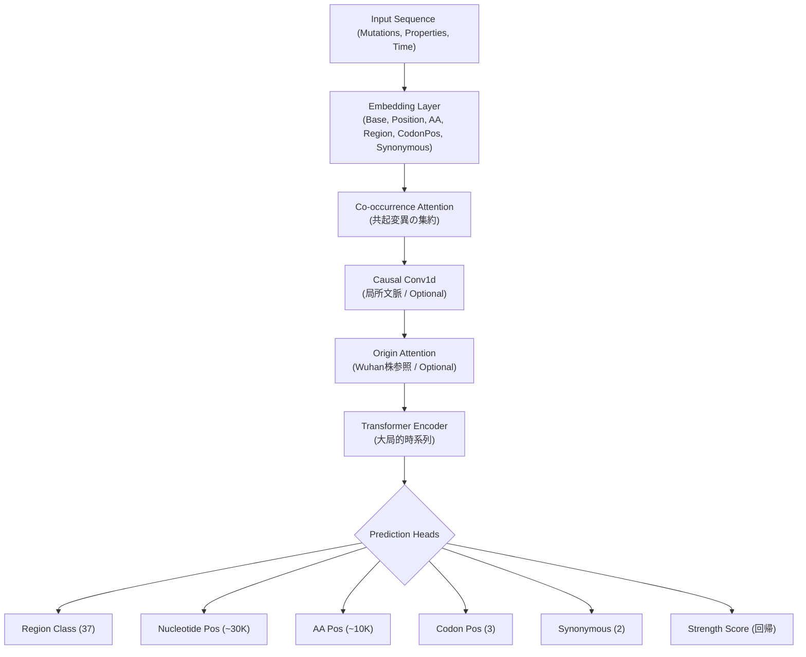

# Gemp (Genome Mutation Prediction)

**Transformer-based Viral Evolution & Epidemic Dynamics Prediction**

## 📖 Overview

**Gemp** は、ウイルスの遺伝子変異を「言語」として捉え、Transformerモデルを用いて
**「次に出現する危険な変異」** と **「その流行規模（Strength）」** を予測するAIフレームワークです。

既存のワクチン開発が「変異が起きてから対応する（後手）」のに対し、本モデルは過去の変異文脈から将来のダイナミクスを予測し、
**「変異が起きる前に先回りして対策する（先手）」** ことを目指して開発されました。

### Key Capabilities

1. **時系列ダイナミクスの学習:** 単なるパターン認識ではなく、変異の順序（文脈）を学習し、未知の期間における変異傾向を予測。
2. **流行強度の予測:** 変異の内容だけでなく、その株がパンデミックを起こすリスク（Strength Score）を回帰予測。
3. **マルチタスク学習:** 塩基レベル・アミノ酸レベルの位置予測を同時に行うことで、生物学的に妥当な予測を実現。
4. **DuckDBによる高効率データ管理:** 大規模ゲノムデータをDuckDBに格納し、メモリ効率良くストリーミングロードする。

---

## 🚀 Features

- **Hierarchical Transformer:**
  - **Co-occurrence Attention:** 同時に発生する変異（共起）の関係性を集約。
  - **Causal Conv1d (Optional):** 局所的な文脈と短期的な依存関係を抽出（`USE_LOCAL_CONV1D`）。
  - **Origin Attention (Optional):** 原点（Wuhan株）を常に参照するCross-Attention（`USE_ORIGIN_ATTENTION`）。
  - **Transformer Encoder:** 大局的な時系列変化を捉える。

- **Multi-Task Prediction Heads (6タスク):**
  | タスク | 内容 | 損失重み |
  |---|---|---|
  | `Region` | タンパク質領域（37クラス） | 0.14 |
  | `Position` | 塩基配列上の絶対位置（~30000クラス） | 0.70 |
  | `AA Position` | アミノ酸残基レベルの位置（~10000クラス） | 0.10 |
  | `Codon Position` | コドン内の位置（1/2/3の3クラス） | 0.04 |
  | `Synonymous` | 同義/非同義変異の区別（2クラス） | 0.02 |
  | `Strength` | 流行規模スコア（Log-scale 回帰） | 0.02 |

- **高度な学習設定:**
  - `Focal Loss` によるクラス不均衡対策
  - `Label Smoothing` による過学習抑制
  - `CosineAnnealingLR` スケジューラ
  - `MultiTaskLoss`（Kendall et al.）による損失重みの自動調整（オプション）

- **豊富な評価指標:**
  - Hit Rate / Precision / Recall / F1（タイムステップ別・流行度カテゴリ別）
  - **Weighted Recall@1** / **Macro Recall@1**（クラス単位の公平な評価）
  - 流行度カテゴリ（Low/Medium/High）別比較
  - ランダムベースラインとの比較
  - タンパク質領域別・混同行列出力

- **可視化:**
  - 学習曲線、タイムステップ別・カテゴリ別メトリクスグラフ
  - 変異位置分布比較（Ground Truth vs Prediction）
  - 語彙埋め込みネットワーク（塩基・位置・クラスタ・t-SNE）

---

## 🛠️ Architecture


```mermaid
graph TD
    Input["Input Sequence (Mutations, Properties, Time)"] --> Embed["Embedding Layer\n(Base, Position, AA, Region, CodonPos, Synonymous)"]
    Embed --> CoAttn["Co-occurrence Attention\n(共起変異の集約)"]
    CoAttn --> Conv["Causal Conv1d\n(局所文脈 / Optional)"]
    Conv --> OriAttn["Origin Attention\n(Wuhan株参照 / Optional)"]
    OriAttn --> Transformer["Transformer Encoder\n(大局的時系列)"]
    Transformer --> Heads{"Prediction Heads"}
    Heads --> Out1["Region Class (37)"]
    Heads --> Out2["Nucleotide Pos (~30K)"]
    Heads --> Out3["AA Pos (~10K)"]
    Heads --> Out4["Codon Pos (3)"]
    Heads --> Out5["Synonymous (2)"]
    Heads --> Out6["Strength Score (回帰)"]
```

---

## 📂 Directory Structure

```text
gmp/
├── README.md
├── meta_data/                    # ゲノムアノテーション・アミノ酸特性
│   ├── codon_mutation4.csv       # コドン変異テーブル（位置→遺伝子領域マッピング）
│   └── aa_properties/            # アミノ酸理化学特性（疎水性・電荷・PAM250等）
│
├── transformer_260416/           # 現行メインパッケージ
│   ├── config.py                 # ハイパーパラメータ・ファイルパス設定
│   ├── model.py                  # HierarchicalTransformer / MultiTaskLoss
│   ├── train.py                  # 学習ループ（1エポック分）
│   ├── evaluate.py               # 評価・推論ロジック（全メトリクス計算）
│   ├── preprocess.py             # DuckDB構築用前処理スクリプト
│   ├── main.py                   # 実行エントリポイント
│   │
│   ├── db/                       # DuckDB データアクセス層
│   │   ├── connection.py         # DB接続・存在確認・統計表示
│   │   ├── dataset.py            # DB対応 DataLoader
│   │   └── queries.py            # SQLクエリ集
│   │
│   ├── utils/                    # ユーティリティパッケージ
│   │   ├── logging.py            # ログ出力・calculate_metrics・calculate_weighted_macro_recall
│   │   ├── io.py                 # 結果保存（CSV/pickle/キャッシュ）
│   │   └── plotting.py           # 可視化（学習曲線・メトリクス・語彙ネットワーク・変異分布）
│   │
│   └── legacy/                   # pickle キャッシュ方式（旧互換）
│       └── dataset.py
│
├── transformer_260224/           # 前バージョン（参照用）
│
├── outputs/
│   └── transformer_260416/
│       └── results/<timestamp>/  # 1実行ごとの出力先
│           ├── best_model.pth
│           ├── config_snapshot.py
│           ├── training_log.csv
│           ├── training_curve.png
│           ├── valid_predictions.csv
│           ├── valid_metrics_by_timestep.csv
│           ├── valid_recall_summary.csv       ← Weighted/Macro Recall@1
│           ├── valid_region_metrics.csv
│           ├── valid_confusion_matrix.csv
│           ├── valid_random_baseline.csv
│           ├── valid_metrics_plot.png
│           ├── valid_category_plot.png
│           ├── valid_predictions_mutation_dist.png
│           ├── test_* (同上)
│           ├── combined_val_test_metrics.png
│           ├── combined_category_comparison.png
│           ├── vocab_network_base_<ts>.png    ← 塩基埋め込みネットワーク
│           ├── vocab_heatmap_base_<ts>.png
│           ├── pos_network_threshold_<ts>.png
│           ├── pos_tsne_<ts>.png
│           ├── pos_cluster_network_<ts>.png
│           └── pos_major_mutations_<ts>.png
│
└── db/                           # DuckDBデータベースファイル格納先
```

---

## ⚙️ Installation & Usage

### 1. Requirements

Python 3.10+ 環境にて、必要なライブラリをインストールしてください。

```bash
pip install torch pandas numpy matplotlib scikit-learn networkx duckdb wandb tabulate
```

### 2. Configuration

`transformer_260416/config.py` にて、データパスや学習パラメータを設定します。

```python
# 主要設定項目
EPOCHS = 15
BATCH_SIZE = 512
USE_DB = True               # DuckDB使用（推奨）
USE_FOCAL_LOSS = True       # Focal Loss
USE_LABEL_SMOOTHING = True  # Label Smoothing
USE_LOCAL_CONV1D = True     # 局所Conv1d
USE_ORIGIN_ATTENTION = True # Origin Attention
TOP_K_EVAL = 1              # Top-K評価（1でRecall@1）
```

### 3. Preprocessing（初回のみ）

DuckDB にゲノムデータを格納します（`USE_DB = True` の場合）。

```bash
python -m transformer_260416.preprocess
```

### 4. Training & Evaluation

```bash
python -m transformer_260416.main
```

実行後、`outputs/transformer_260416/results/<timestamp>/` に全出力が保存されます。

---

## 📊 Evaluation Metrics

### Hit Rate（サンプル単位）

各サンプルについて「Top-K予測の中に正解が含まれるか」を判定するマクロ平均。
共起（複数正解）の場合、いずれか1つに正解すればヒット。

### Weighted Recall@1 / Macro Recall@1（クラス単位）

クラス不均衡が大きい位置予測タスクの公平な評価指標。

| 指標 | 計算式 | 特性 |
|---|---|---|
| **Weighted Recall@1** | `Σ(tp_c) / Σ(count_c)` | 出現頻度の高いクラスを重視 |
| **Macro Recall@1** | `mean_c(tp_c / count_c)` | 稀なクラスを均等に評価 |

`valid_recall_summary.csv` および `test_recall_summary.csv` に保存されます。

### 流行度カテゴリ（Strength Category）

変異株の流行規模を `log(1 + sample_count)` スケールで3分類：

| カテゴリ | 閾値（デフォルト） | 概算サンプル数 |
|---|---|---|
| Low | < 3.0 | ~20 |
| Medium | 3.0 ~ 5.0 | ~20〜150 |
| High | ≥ 5.0 | 150+ |

### Output Example（コンソール）

```text
=== Recall@1 Summary (TEST) ===
  Task                    WeightedRecall@1   MacroRecall@1
  ---------------------------------------------------------
  タンパク質領域                    52.34%          38.21%
  塩基配列位置                      31.05%          12.44%
  アミノ酸配列位置                  29.88%          11.92%
  コドン位置                        61.20%          58.73%
  シノニマス                        72.10%          71.45%
```

---

## 🔬 Ablation Study

`config.py` の以下のフラグで各コンポーネントの有効/無効を切り替えられます：

```python
USE_LOCAL_CONV1D = False         # Conv1d局所特徴抽出を無効化
USE_ORIGIN_ATTENTION = False     # Origin Attentionを無効化
USE_FOCAL_LOSS = False           # 通常のCrossEntropyLossに切り替え
USE_LABEL_SMOOTHING = False      # Label Smoothingを無効化

# 数値特徴量の個別マスク（再構築不要）
ABLATION_MASKS = {
    'FREQ': False,    # 変異頻度
    'HYDRO': False,   # 疎水性差
    'CHARGE': False,  # 電荷差
    'SIZE': False,    # サイズ差
    'BLSM': False,    # BLOSUM62
    'PAM250': False,  # PAM250
}
```

---

## 📝 License

[MIT License / Research Use Only]

---

**Author:** Takeru Aiba