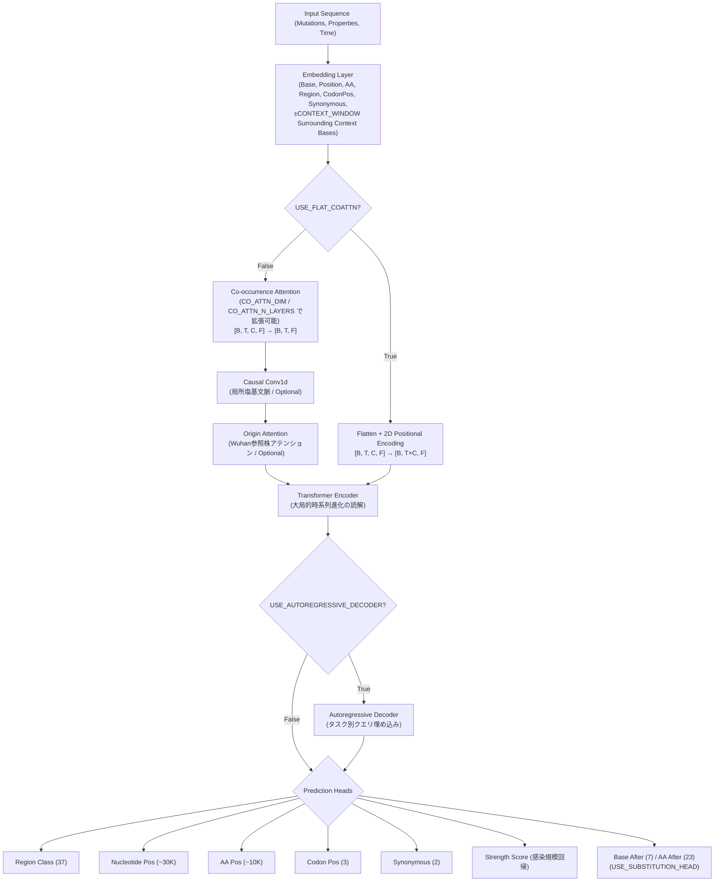
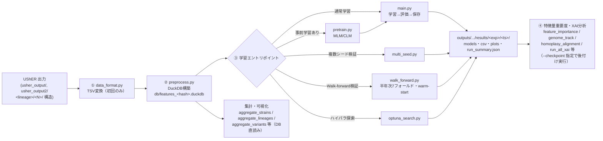

# 🧬 Viral Genome Mutation Prediction Model (v260707)

本プロジェクトは、新型コロナウイルス（SARS-CoV-2）をはじめとするウイルスゲノムの変異発生予測を行う、高度な時系列マルチタスク・ディープラーニングモデル（Hierarchical Transformer）のコードベースです。
変異の時系列的な蓄積ステップ（Mutation Step）と、同時に発生した共起変異の集合を高度にモデル化し、将来のパンデミックを引き起こす変異の早期予測と進化シミュレーションを実現します。

---

## 📚 詳細ドキュメント

本 README は概要・アーキテクチャ・実行方法に絞っています。詳細な研究ノート・提案・履歴は以下を参照してください。

- [docs/features.md](docs/features.md) — 主要機能の実装詳細
- [docs/ablation.md](docs/ablation.md) — アブレーションマスク全項目
- [docs/xai_usage.md](docs/xai_usage.md) — 特徴量重要度・XAI分析の全コマンド
- [docs/analysis.md](docs/analysis.md) — 精度特性の分析・根本課題・改善の方向性
- [docs/roadmap.md](docs/roadmap.md) — 今後の展望（未実装の提案一覧）
- [docs/changelog.md](docs/changelog.md) — 既知の不具合・修正履歴

---

## ✨ 主要機能（v260707 搭載機能）

- **NCBI/UShERダブル系統名・流行度システムの統合** — `config.STRENGTH_SOURCE`（`'ncbi'`/`'usher'`）で参照系統名・流行度を動的切り替え。
- **追加Usher出力ディレクトリ・追加サンプルCSVの取り込み** — `EXTRA_DATA_BASE_DIRS` / `EXTRA_SEQUENCES_CSV` で複数データソースを横断処理。
- **ホスト適応特徴量（24次元）** — RSCU・コドン頻度・CAI 等のコドン組成ベース特徴量。
- **パス内累積変異カウント特徴量** — シノニマス/ノンシノニマス変異の累積数（`cum_syn`/`cum_nonsyn`）。
- **亜系統の流行ダイナミクス特徴（4次元）** — 収集日以前のデータのみで計算する因果的な成長・適応度代理（`USE_LINEAGE_GROWTH_FEATURES`）。
- **前後コンテキスト塩基の窓幅拡張** — `CONTEXT_WINDOW`（既定±5）で±3/±5/±7を動的切替。
- **高精度マルチタスク学習** — Region/NucPos/AAPos/CodonPos/Synonymous/BaseAfter/AAAfter/Strength を同時予測。
- **時系列マルチタスクの学習** — Mutation Step に沿った進化遷移の学習。
- **Co-occurrence Attention の多段階拡張** — `CO_ATTN_DIM`/`CO_ATTN_N_LAYERS`/`USE_FLAT_COATTN` で共起集約の表現力をアブレーション比較。
- **DuckDB による超高速データベース＆バルク処理** — 数百万レコード規模でもメモリ効率的なストリームバッチ学習。
- **多角的な評価・出力システム** — 感染規模9区分・系統別 HitRate/エントロピー・`run_summary.json`・R-Precision 等。
- **メンテナンスフリーな動的ロギング** — `{__package__}` によるバージョン非依存なログ出力。
- **実験ハーネス・高速化・分析ツール（v260707 拡張）** — マルチシード/Walk-forward/Optuna の3ハーネス、DataLoader並列化（~2.0x）、特徴量重要度・生物学的XAIスイート。

**→ 各機能の実装詳細は [docs/features.md](docs/features.md) を参照。**

---

## 🛠️ Architecture（アーキテクチャ）

同時に発生した共起変異の集合順序への依存性を解消し、位置エンコーディングの矛盾を防ぐための **Co-occurrence Attention (共起集約層)** を中核とする革新的なネットワーク構造です。


```mermaid
graph TD
    Input["Input Sequence (Mutations, Properties, Time)"] --> Embed["Embedding Layer\n(Base, Position, AA, Region, CodonPos, Synonymous,\n±CONTEXT_WINDOW Surrounding Context Bases)"]

    Embed --> FlatSwitch{USE_FLAT_COATTN?}
    FlatSwitch -->|False| CoAttn["Co-occurrence Attention\n(CO_ATTN_DIM / CO_ATTN_N_LAYERS で拡張可能)\n[B, T, C, F] → [B, T, F]"]
    FlatSwitch -->|True| FlatSeq["Flatten + 2D Positional Encoding\n[B, T, C, F] → [B, T×C, F]"]

    CoAttn --> Conv["Causal Conv1d\n(局所塩基文脈 / Optional)"]
    Conv --> OriAttn["Origin Attention\n(Wuhan参照株アテンション / Optional)"]
    OriAttn --> Transformer

    FlatSeq --> Transformer["Transformer Encoder\n(大局的時系列進化の読解)"]

    Transformer --> ARSwitch{USE_AUTOREGRESSIVE_DECODER?}
    ARSwitch -->|False| Heads{"Prediction Heads"}
    ARSwitch -->|True| ARDec["Autoregressive Decoder\n(タスク別クエリ埋め込み)"]
    ARDec --> Heads

    Heads --> Out1["Region Class (37)"]
    Heads --> Out2["Nucleotide Pos (~30K)"]
    Heads --> Out3["AA Pos (~10K)"]
    Heads --> Out4["Codon Pos (3)"]
    Heads --> Out5["Synonymous (2)"]
    Heads --> Out6["Strength Score (感染規模回帰)"]
    Heads --> Out7["Base After (7) / AA After (23)\n(USE_SUBSTITUTION_HEAD)"]
```

### 入力特徴量

| 種別 | 次元数 | 内容 |
|---|---|---|
| カテゴリ特徴量 | `9 + 2×CONTEXT_WINDOW` | base_before, position, base_after, codon_pos, aa_before, aa_pos, aa_after, region, synonymous, 前後コンテキスト塩基 |
| 数値特徴量 | 32（+4） | 物理化学6 + ホスト適応24 + 累積変異カウント2（+ 亜系統成長4：`USE_LINEAGE_GROWTH_FEATURES=True` で計36） |

### シーケンスデータ
#### condition
##### reference/sequences-241017.csv (2024/10/18) — `config.SEQUENCES_CSV`
Virus/Taxonomy:Severe acute respiratory syndrome coronavirus 2, taxid:2697049
Sequence Length min:29000 max:30000
Host:Homo sapiens (human), taxid:9606
Release Date: From Jan 1, 2020 To Oct 18, 2024
number : 8,938,263

##### reference/sequences-241017_2.csv (2026/07/10) — `config.EXTRA_SEQUENCES_CSV[0]`（`usher_output2/` に対応）
Virus/Taxonomy:Severe acute respiratory syndrome coronavirus 2, taxid:2697049
Sequence Length min:29000 max:30000
Host:Homo sapiens (human), taxid:9606
Release Date: From Oct 18, 2024 To Jul 10, 2026
Collection Date: From Jan 1, 2020 To Oct 18, 2024
number : 8,938,263

---

## 🔄 実行フロー（パイプライン全体像）

生データから学習・評価・分析までの流れ。各ステップの具体的なコマンドは次の「🚀 Usage」節を参照。


```mermaid
graph LR
    A["UShER 出力\n(usher_output/, usher_output2/\n&lt;lineage&gt;/&lt;N&gt;/ 構造)"] --> B["① data_format.py\nTSV変換（初回のみ）"]
    B --> C["② preprocess.py\nDuckDB構築\ndb/features_&lt;hash&gt;.duckdb"]

    C --> D{"③ 学習エントリポイント"}
    D -->|通常学習| E["main.py\n学習→評価→保存"]
    D -->|事前学習あり| P["pretrain.py\nMLM/CLM"] --> E
    D -->|複数シード検証| MS["multi_seed.py"]
    D -->|Walk-forward検証| WF["walk_forward.py\n半年次7フォールド・warm-start"]
    D -->|ハイパラ探索| OP["optuna_search.py"]

    E --> R["outputs/.../results/&lt;exp&gt;/&lt;ts&gt;/\nmodels・csv・plots・run_summary.json"]
    MS --> R
    WF --> R
    OP --> R

    R --> X["④ 特徴量重要度・XAI分析\nfeature_importance / genome_track /\nhomoplasy_alignment / run_all_xai 等\n（--checkpoint 指定で後付け実行）"]
    C --> AG["集計・可視化\naggregate_strains / aggregate_lineages /\naggregate_variants 等（DB直読み）"]
```

- **① データ変換**: `EXTRA_DATA_BASE_DIRS` を含む全 UShER 出力ディレクトリを横断して TSV へ変換。初回のみ実行。
- **② 前処理**: 特徴量設定（`NUM_CHEM_FEATURES`・`CONTEXT_WINDOW`・`ABLATION_MASKS` 等）のハッシュで DB ファイル名が決まるため、設定が同じなら既存 DB を再利用でき、再前処理は不要。
- **③ 学習**: `main.py` が標準の学習→評価フロー。用途に応じて事前学習（MLM/CLM）を前段に挟む、または `multi_seed` / `walk_forward` / `optuna_search` のいずれかのハーネスから起動する（内部的には同じ train/evaluate ロジックを共有）。
- **④ 事後分析**: 学習済み `best_model.pth` を `--checkpoint` に渡す独立 CLI 群。学習を再実行せず何度でも呼び出せる。集計・可視化スクリプトは DB を直接読むため学習不要。

---

## 🚀 Usage（実行方法）

### 1. 環境構築

```bash
# conda 環境を新規作成（初回のみ）
conda env create -f environment.yml

# または pip で依存パッケージをインストール
pip install -r requirements.txt
pip3 install torch torchvision

# 環境を有効化
conda activate gvp25-05
```

### 2. UShER 出力の変換（初回のみ）
```bash
# config.DATA_BASE_DIR + config.EXTRA_DATA_BASE_DIRS を自動で全て処理する
python -m transformer_260707.scripts.preprocess.data_format

# 1ディレクトリのみに限定したい場合は --base-dir を指定
python -m transformer_260707.scripts.preprocess.data_format --base-dir ../usher_output2/
```

### 3. DuckDB データベースの前処理（初回 or DB 再構築時）
```bash
nice -n 19 python -m transformer_260707.preprocess
```
`config.py` の `NUM_CHEM_FEATURES`・`CONTEXT_WINDOW`・`ABLATION_MASKS` が変更されると、設定ハッシュが自動的に変わり次回実行時に DB が再構築される。

### 4. モデルの学習および評価の実行
```bash
nohup python -m transformer_260707.main > nohup0.out 2>&1 &
tail -f nohup0.out
```
実行完了後、`outputs/transformer_260707/results/<EXPERIMENT_NAME>/<timestamp>/` にすべてのログ、学習曲線、集計CSV、および評価プロット画像が自動保存される。

### 5. 実験ハーネス（複数シード検証・ハイパラ探索）
```bash
# 複数シードで学習→評価し、主要指標を mean±std に集計（single run のノイズ判定用）
python -m transformer_260707.scripts.eval.multi_seed --seeds 42 1 7
#   → results/multi_seed/<ts>/multi_seed_summary.json（aggregate に mean/std/values）

# 半年次 Walk-forward 検証（全7フォールド。config.SPLIT_MODE を触らず起動可）
nohup python -m transformer_260707.scripts.eval.walk_forward > nohup_wf.out 2>&1 &
python -m transformer_260707.scripts.eval.walk_forward --folds 2 6   # 特定フォールドのみ

# Optuna ハイパラ探索（ローカル SQLite 保存＝オフライン・中断再開可、pruning つき）
pip install optuna   # 未導入の場合
python -m transformer_260707.scripts.eval.optuna_search --n-trials 15 --params lr loss_weights
#   → outputs/.../scripts/optuna/<study>.db（全 trial 履歴）, <study>_best.json（ベスト構成）
```
> **探索コストの目安**: 1 trial = 1 学習（実測 1 epoch ≈ 40〜70 分）。フル 15 epoch × 多 trial は数日規模になるため、探索は短 epoch・少 trial（＋pruning）で回し、上位構成のみ multi-seed / walk-forward でフル検証する二段構えを推奨。

### 6. 特徴量重要度・生物学的 XAI 分析
学習済みチェックポイントに対する後付け分析。すべて単独 CLI（`--checkpoint` 指定、`--force_cpu` 対応）で共通基盤上に載る。代表コマンド（新規5本を一括実行、失敗継続）:
```bash
python -m transformer_260707.scripts.analysis.run_all_xai --checkpoint <best.pth> --split test
```
個別スクリプト（feature_importance・permutation_importance・genome_track・homoplasy_alignment・cooccurrence_constellation・local_explain・probe_representation）のコマンド一覧と各分析の内容は **[docs/xai_usage.md](docs/xai_usage.md)** を参照。

### ユーティリティ
```bash
python -m transformer_260707.scripts.inspect.inspect_duckdb    # DB スキーマ確認
python -m transformer_260707.scripts.inspect.view_one_sample   # サンプル内容確認（数値特徴量を表示。成長特徴有効時は36次元）
python -m transformer_260707.scripts.analysis.aggregate_strains    # 株別集計
python -m transformer_260707.scripts.analysis.aggregate_lineages   # 系統別集計
python -m transformer_260707.scripts.analysis.aggregate_variants   # 月別変異株集計
```

---

## 📊 Evaluation Metrics（評価指標）

- **Hit Rate（サンプル単位精度）**
  - 各サンプルについて「Top-K予測の中に、実際に発生した共起変異が1つでも含まれるか」を測定。

- **Weighted Recall@1 / Macro Recall@1（クラス単位評価）**
  - クラス不均衡が極めて大きい遺伝子位置予測において、高頻度クラスを重視する Weighted と、稀なクラスも公平に評価する Macro の双方でリコールを測定。

- **感染規模カテゴリ別精度**
  - `log(1 + sample_count)` スケールで **Low/Medium/High の3区分** と **9区分の細分化**（〜100/〜500/〜1K/〜5K/〜10K/〜50K/〜100K/〜500K/>500K）でカテゴリ別精度を保存。
  - `config.SAVE_STRAIN_METRICS = True` で株単位の `{prefix}_strain_metrics.csv` も出力可能。

- **系統別精度・予測難易度（`{prefix}_lineage_metrics.csv`）**
  - Pango lineage の上位2階層（例: BA.2, XBB.1）でグループ化。
  - 各系統のHitRateに加え、ターゲット変異位置分布のエントロピー（予測難易度）を集計。

- **R-Precision（`{prefix}_r_precision.csv`）**
  - `USE_R_PRECISION=True` 時、各サンプルの実際の共起変異数 $R$ を $K$ とした動的 Top-$R$ 評価結果を独立ファイルに保存。

- **run_summary.json**
  - 実験ごとに HitRate@K・Macro Recall・Val/Test Loss を1ファイルにまとめた軽量JSON。

---

## 🔬 Ablation Study（アブレーション実験）

`config.py` 内のフラグで各特徴量やニューラルネットワーク層の有効/無効を切り替え、各コンポーネントが予測性能に与える影響度を測定できます。主要な構造系フラグ:

```python
USE_LOCAL_CONV1D = False         # Conv1d局所特徴抽出の切り替え
USE_ORIGIN_ATTENTION = False     # Origin Attention（武漢株参照）の切り替え

# Co-occurrence Attention 拡張（共起集約の表現力比較）
CO_ATTN_N_HEADS  = 4            # 共起 Attention のヘッド数
CO_ATTN_N_LAYERS = 1            # 2以上で変異間 Self-Attention を多段化
CO_ATTN_DIM      = 256          # 内部次元
USE_FLAT_COATTN  = False        # True: 全変異を独立トークンとして Transformer に渡す

# コンテキスト窓幅（再前処理が必要）
CONTEXT_WINDOW = 5              # 前後各方向の塩基数。3 / 5 / 7 で切り替え
```

これに加え、数値・カテゴリ特徴量ごとの個別アブレーションマスク（`ABLATION_MASKS`、物理化学6・ホスト適応24・累積変異2・亜系統成長4・コンテキスト塩基11の計47項目、再前処理不要・動的適用）がある。**全項目一覧は [docs/ablation.md](docs/ablation.md) を参照。**

---

## ⚙️ 学習設定・実験ハーネス・高速化（v260707 で拡張）

### 早期終了の対象メトリクス（hit-rate 対応）
`val_loss` は hit-rate と乖離することがある（例: MLM 事前学習は hit-rate を上げるが loss は悪化）ため、**実際の評価指標で checkpoint を選べる**よう早期終了の対象を切り替え可能。

```python
# config.py
EARLY_STOPPING_METRIC = 'val_position_hit_rate'  # 'val_<task>_<指標>' 形式
EARLY_STOPPING_MODE   = 'max'                     # hit-rate 系は 'max'
# task  = region / position / aa_pos / codon_pos / synonymous
# 指標  = hit_rate / macro_recall / weighted_recall / f1 / precision / recall
#   （これらは per-epoch の evaluate() が算出。top-k / r_precision は最終評価のみで対象外）
#   存在しないキーは WARNING を出して val_loss にフォールバック（checkpoint 未保存事故を防止）
```

### DataLoader 並列化（学習高速化）
学習は GPU 計算ではなく **DuckDB ストリーミング＋per-sample の Python 処理が律速**（バッチサイズを変えても学習時間が変わらないのはこのため）。ワーカーを増やしてデータ前処理を GPU 計算とオーバーラップさせると時短できる。**ストリーミング設計は維持されメモリはデータ量に比例しない**（増分はワーカー数ぶんの固定分のみ）。

```python
# config.py
NUM_DATALOADER_WORKERS        = 8      # 0=同期（従来）。実測で 8 が ~2.0x（4 は ~1.3x, 28コア環境）
DATALOADER_PREFETCH_FACTOR    = 2
DATALOADER_PERSISTENT_WORKERS = True
DATALOADER_PIN_MEMORY         = True
DATALOADER_DUCKDB_THREADS     = None  # ワーカー内は自動で 2（スレッド張りすぎ＝オーバーサブスクライブ防止）
```
`DBIterableDataset` はワーカーごとに `sample_ids` をストライド分割（sharding）し、データ重複なく並列化する。

### プロット出力の個別トグル
各評価プロットを個別に出力/抑制できる（重い可視化を切って高速化）。`config.PLOT_OUTPUTS`（25キーの dict、キー無し/True=出力＝従来動作）。

### 系統別の予測難易度プロット（3種：エントロピー代替を含む）
「系統ごとのターゲット位置の分散度」と position hit-rate の関係を、横軸を変えた3図で可視化する。分散が大きい系統ほど次変異の候補が広く、予測が難しい。

| プロット | 横軸（分散度指標） | 解釈 | 出力ファイル |
|---|---|---|---|
| `entropy_vs_accuracy` | 正規化エントロピー | 情報理論指標 | `{prefix}_entropy_vs_accuracy.png` |
| `labeldiversity_vs_accuracy` | **ユニーク率**（ユニーク位置数 / 全位置出現数） | 「ターゲットの何割が異なる位置か」。素朴だがサンプル数が多い系統ほど低く出る傾向 | `{prefix}_labeldiversity_vs_accuracy.png` |
| `simpson_vs_accuracy` | **Gini–Simpson 多様度** D=1−Σpᵢ² | 「無作為に2つ選んで別位置になる確率」。生態学標準の生物多様度指数で**生物系に説明不要**・サンプル数バイアスに強い | `{prefix}_diversity_simpson_vs_accuracy.png` |

いずれも 0→集中（予測が易しい）〜 1→分散（難しい）で、エントロピーが伝わりにくい相手には **Simpson を主図**に推奨。各図は `PLOT_OUTPUTS` の同名キーで個別トグル可。

**再現性・run 間比較のための裏づけCSV**: 3図は共通の集計（`_lineage_diversity_rows`）を使い、その元テーブルを `{prefix}_lineage_diversity.csv`（列: `lineage, n, hit_rate, entropy_norm, unique_ratio, simpson`）として**常時出力**する。PNG はコード版に依存し比較しづらいため、run 間の比較・別指標での再描画はこの CSV を基準にする。系統粒度は **Pango 上位2階層**（`lineage_metrics.csv` と統一）、採用する最小サンプル数は `config.DIVERSITY_PLOT_MIN_SAMPLES`（既定10）で制御。

### マルチシード検証・Walk-forward・Optuna 探索
- **マルチシード**（`MULTI_SEED` / `scripts/eval/multi_seed.py`）: 複数シードで学習し主要指標を mean±std に集計。single run の差がノイズか本物かを判定。採用基準は「複数シード/ walk-forward で符号が安定」。
- **Walk-forward**（`SPLIT_MODE='walk_forward'`）: 半年次7フォールド。Fold 1 のみ事前学習（リークなし）、以降は直前フォールドの重みを warm-start（Method B）。DB 再構築不要。
- **Optuna**（`OPTUNA_*` / `scripts/eval/optuna_search.py`）: ローカル SQLite 保存でオフライン・中断再開可。TPE + MedianPruner。探索対象は `LEARNING_RATE` / `DROPOUT` / `LOSS_WEIGHT_{REGION,POSITION,AA_POS}`（position↑/領域↓トレードオフを直接制御）。目的関数は val hit-rate（test はリーク回避のため使わない）。

> いずれもコマンドは「🚀 Usage → 5. 実験ハーネス」を参照。

---

## 🧬 Baseline Comparison（先行研究 PETra との比較実験）

[PETra](https://github.com/xz-keg/PETra) を含む先行研究に対する本提案アーキテクチャの有効性を科学的に検証するため、リファクタリング済みの同一コードベースを用い、**通常の損失関数（CrossEntropy等）のまま**、以下の3つのモデル構成を同一データセットで対比検証します。

| 比較軸 | モデル①: 先行研究ベース <br>(PETra相当) | モデル②: 中間モデル <br>(直列＋物理化学特徴量) | モデル③: 提案モデル <br>(集約層＋物理化学特徴量) |
| :--- | :---: | :---: | :---: |
| **同時変異（共起）の扱い** | 直列入力 (位置の嘘の時間差) | 直列入力 (位置の嘘の時間差) | **共起変異の集約層 (Co-occurrence Attention)** |
| **生物学的特徴量** | なし | **あり** (電荷・疎水性・コドン頻度等 32次元) | **あり** (電荷・疎水性・コドン頻度等 32次元) |
| **位置エンコーディングの矛盾** | あり (直列順序に依存) | あり (直列順序に依存) | **なし** (集合としての処理により解消) |
| **検証の目的** | PETra相当の基準（Baseline）測定 | 物理化学特徴量による純粋な精度向上効果の証明 | 共起変異集約による本質的なアーキテクチャ効果の証明 |

### 比較実験のポイント
1. **モデル① 先行研究ベース（直列入力 ＋ 特徴量なし）**: 同時に発生した変異に対して、便宜的に直列の順序を割り当てて Transformer に入力し、生物学的特徴量を一切与えない構成。先行研究 **PETra** 相当の基準点（Baseline）。
2. **モデル② 中間モデル（直列入力 ＋ 特徴量あり）**: モデル①の構成に32次元の生化学・ホスト適応特徴量を統合。「生物学的知識」の追加効果を純粋に実証。
3. **モデル③ 提案モデル（集約層あり ＋ 特徴量あり）**: 物理化学特徴量に加え、**Co-occurrence Attention** で共起変異を順序非依存に集約。位置エンコーディングの矛盾解消によるアーキテクチャ効果を証明。

### PETra 相当ベースライン（モデル①）の設定方法

```python
# config.py

# 共起変異を独立トークンとして直列化（Co-occurrence Attention をバイパス）
USE_FLAT_COATTN    = True
# 1D 正弦波 PE を使用: 共起グループを識別しない = PETra 相当の純粋時系列扱い
FLAT_COATTN_1D_PE  = True
# トークン数が T×C = 780 に増加するためバッチサイズを削減
BATCH_SIZE         = 64

# 全物理化学・ホスト適応特徴量を無効化
ABLATION_MASKS = {
    'FREQ': True, 'HYDRO': True, 'CHARGE': True, 'SIZE': True,
    'BLSM': True, 'PAM250': True,
    'HOST_LOG_RATIO_DIFF': True, 'HOST_LOG_RATIO_BEFORE': True,
    'HUMAN_RSCU_DIFF': True, 'SCV2_RSCU_DIFF': True,
    # ... 全フラグを True に設定
    'CUM_SYN': True, 'CUM_NONSYN': True,
    'MUTATION_CONTEXT': True,
}
```

**モデル②（直列入力 ＋ 特徴量あり）** は上記から `ABLATION_MASKS` を全て `False` に戻すだけで実現できる。
**モデル③（提案）** はデフォルト設定（`USE_FLAT_COATTN=False`）がそのまま対応する。

> **Note**: `FLAT_COATTN_1D_PE=False`（デフォルト）のままにすると、2D PE により共起グループが識別されるため PETra 相当にならない点に注意。

---

※ 実装済みの全機能は `config.py` 上のフラグによりワンタッチで有効/無効の切り替えが可能な設計とします。未実装の提案・既知の不具合は冒頭「📚 詳細ドキュメント」の各リンクを参照してください。

---

## 📝 License

[MIT License / Research Use Only]

---

**Author:** Takeru Aiba
