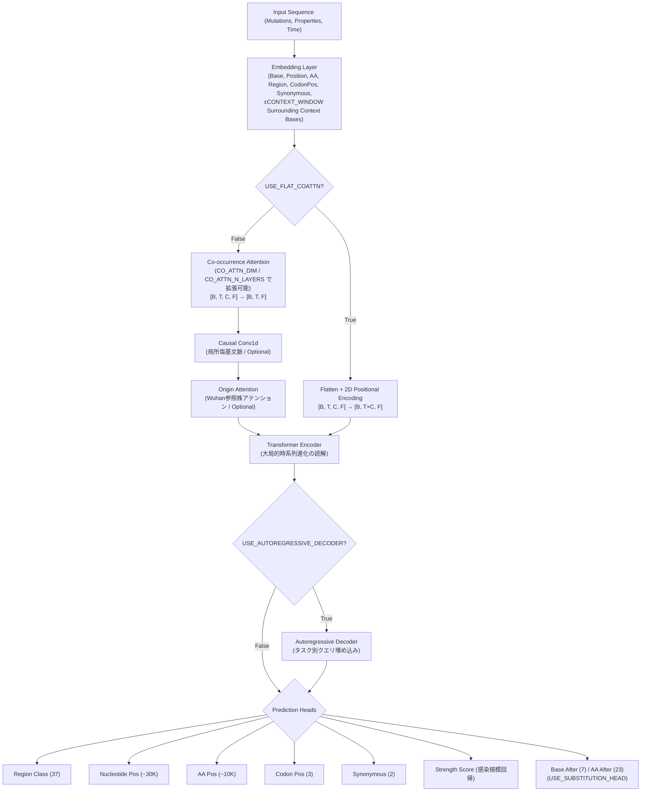

# 🧬 Viral Genome Mutation Prediction Model (v260625)

本プロジェクトは、新型コロナウイルス（SARS-CoV-2）をはじめとするウイルスゲノムの変異発生予測を行う、高度な時系列マルチタスク・ディープラーニングモデル（Hierarchical Transformer）のコードベースです。
変異の時系列的な蓄積ステップ（Mutation Step）と、同時に発生した共起変異の集合を高度にモデル化し、将来のパンデミックを引き起こす変異の早期予測と進化シミュレーションを実現します。

---

## ✨ 主要機能（v260625 搭載機能）

- **NCBI/UShERダブル系統名・流行度システムの統合（動的切り替え）**
  - 配列メタデータ上の系統名（NCBI）と、系統樹トポロジー上の placements から得られる系統名（UShER）の双方をDBに抽出し、保持・表示。
  - UShERの `clades.txt` からNextclade名（Clade最頻値）およびサンプル数を自動集計する機構を導入。
  - `config.STRENGTH_SOURCE` の切り替え（`'ncbi'` / `'usher'`) だけで、モデル学習や評価時に参照する系統名・流行度を動的に切り替え可能。

- **ホスト適応特徴量の統合（24次元）**
  - `reference/codon/SCV2_host_adaptation_features.csv` に集約された24種類のコドン組成ベース特徴量を数値入力に追加。
  - ヒト・SCV2 の RSCU・コドン頻度・CAI（相対的適応度）の変異前後の値と差分、コドン最適性フラグ（optimal_to_optimal 等）、トランジション/トランスバージョン、CpG/UpA ジヌクレオチド変化量、宿主距離対数比などを網羅。
  - `reference/codon/generate_host_adaptation_features.py` で再生成可能。

- **パス内累積変異カウント特徴量の追加**
  - 入力パスにおけるシノニマス変異・ノンシノニマス変異それぞれの累積カウントを数値特徴量（`cum_syn`/`cum_nonsyn`）として追加。
  - 各タイムステップ開始前の累積値を渡すため、同一タイムステップ内の共起変異は全て同じ値を参照する。

- **前後コンテキスト塩基の窓幅拡張（`CONTEXT_WINDOW` で制御）**
  - 変異位置の前後塩基を `config.CONTEXT_WINDOW`（デフォルト ±5）で動的に制御。±3/±5/±7 を config の変更だけで切り替え可能。
  - カテゴリ特徴量 = 9（固定）+ 2×CONTEXT_WINDOW（コンテキスト）。
  - アブレーションマスクも `MUTATION_CONTEXT_L1`〜`L7` / `R1`〜`R7` で1塩基単位の個別制御に対応。

- **高精度マルチタスク学習**
  - 変異の発生する「遺伝子領域（37分類）」、「ゲノム位置（~3万分類）」、「アミノ酸位置（~1万分類）」、「コドン内位置（3分類）」、「同義/非同義（2分類）」、「塩基変化先（7分類）」、「アミノ酸変化先（23分類）」、およびその変異株の「流行規模（Strength Score / 回帰）」をマルチタスクで同時に学習・予測。

- **時系列マルチタスクの学習**
  - 変異の時系列ステップ（Mutation Step）に伴う進化の遷移を学習し、未知の時間の経過に合わせて変異発生時期を高度に予測。

- **Co-occurrence Attention の多段階拡張（Omicron期大規模共起への対応）**
  - `CO_ATTN_DIM`（内部次元拡大）、`CO_ATTN_N_LAYERS`（変異間 Self-Attention の多段化）、`USE_FLAT_COATTN`（全変異を独立トークンとして Transformer に直接入力）の3フラグで共起集約の表現力をアブレーション比較可能。

- **DuckDB による超高速データベース＆バルク処理**
  - 数百万レコードに及ぶ大規模な変異パスとゲノムメタデータを DuckDB で管理し、メモリ効率的かつ高速なストリームバッチ学習を実現。

- **多角的な評価・出力システム**
  - 感染規模9区分（〜100/〜500/〜1K/〜5K/〜10K/〜50K/〜100K/〜500K/>500K）の精度ファイル分割。
  - 系統（Pango 上位2階層）単位でのHitRate・予測難易度エントロピーを集計した `{prefix}_lineage_metrics.csv` を常時出力。
  - 実験横断スクリプト比較のための `run_summary.json`（主要指標を軽量JSONで保存）。
  - `USE_R_PRECISION=True` 時の R-Precision 結果を独立ファイル `{prefix}_r_precision.csv` に保存。

- **メンテナンスフリーな動的ロギング**
  - バージョンアップに伴う日付コードの置換漏れを防ぐため、エラーログメッセージ内のパッケージ名を `{__package__}` を用いて自動取得するよう動的化。

---

## 🛠️ Architecture（アーキテクチャ）

同時に発生した共起変異の集合順序への依存性を解消し、位置エンコーディングの矛盾を防ぐための **Co-occurrence Attention (共起集約層)** を中核とする革新的なネットワーク構造です。


```mermaid
graph TD
    Input["Input Sequence (Mutations, Properties, Time)"] --> Embed["Embedding Layer\n(Base, Position, AA, Region, CodonPos, Synonymous,\n±CONTEXT_WINDOW Surrounding Context Bases)"]

    Embed --> FlatSwitch{USE_FLAT_COATTN?}
    FlatSwitch -->|False| CoAttn["Co-occurrence Attention\n(CO_ATTN_DIM / CO_ATTN_N_LAYERS で拡張可能)\n[B, T, C, F] → [B, T, F]"]
    FlatSwitch -->|True| FlatSeq["Flatten + 2D Positional Encoding\n[B, T, C, F] → [B, T×C, F]"]

    CoAttn --> Conv["Causal Conv1d\n(局所塩基文脈 / Optional)"]
    Conv --> OriAttn["Origin Attention\n(Wuhan参照株アテンション / Optional)"]
    OriAttn --> Transformer

    FlatSeq --> Transformer["Transformer Encoder\n(大局的時系列進化の読解)"]

    Transformer --> ARSwitch{USE_AUTOREGRESSIVE_DECODER?}
    ARSwitch -->|False| Heads{"Prediction Heads"}
    ARSwitch -->|True| ARDec["Autoregressive Decoder\n(タスク別クエリ埋め込み)"]
    ARDec --> Heads

    Heads --> Out1["Region Class (37)"]
    Heads --> Out2["Nucleotide Pos (~30K)"]
    Heads --> Out3["AA Pos (~10K)"]
    Heads --> Out4["Codon Pos (3)"]
    Heads --> Out5["Synonymous (2)"]
    Heads --> Out6["Strength Score (感染規模回帰)"]
    Heads --> Out7["Base After (7) / AA After (23)\n(USE_SUBSTITUTION_HEAD)"]
```

### 入力特徴量

| 種別 | 次元数 | 内容 |
|---|---|---|
| カテゴリ特徴量 | `9 + 2×CONTEXT_WINDOW` | base_before, position, base_after, codon_pos, aa_before, aa_pos, aa_after, region, synonymous, 前後コンテキスト塩基 |
| 数値特徴量 | 32 | 物理化学6 + ホスト適応24 + 累積変異カウント2 |

---

## 🚀 Usage（実行方法）

### 1. 環境構築
```bash
conda activate gvp25-05
```

### 2. UShER 出力の変換（初回のみ）
```bash
python -m transformer_260625.scripts.data_format
```

### 3. DuckDB データベースの前処理（初回 or DB 再構築時）
```bash
nice -n 19 python -m transformer_260625.preprocess
```
`config.py` の `NUM_CHEM_FEATURES`・`CONTEXT_WINDOW`・`ABLATION_MASKS` が変更されると、設定ハッシュが自動的に変わり次回実行時に DB が再構築される。

### 4. モデルの学習および評価の実行
```bash
nohup python -m transformer_260625.main > nohup0.out 2>&1 &
tail -f nohup0.out
```
実行完了後、`outputs/transformer_260625/results/<EXPERIMENT_NAME>/<timestamp>/` にすべてのログ、学習曲線、集計CSV、および評価プロット画像が自動保存される。

### ユーティリティ
```bash
python -m transformer_260625.scripts.inspect_duckdb        # DB スキーマ確認
python -m transformer_260625.scripts.view_one_sample       # サンプル内容確認（全32次元数値特徴量表示）
python -m transformer_260625.scripts.aggregate_strains     # 株別集計
python -m transformer_260625.scripts.aggregate_lineages    # 系統別集計
python -m transformer_260625.scripts.aggregate_variants    # 月別変異株集計
```

---

## 📊 Evaluation Metrics（評価指標）

- **Hit Rate（サンプル単位精度）**
  - 各サンプルについて「Top-K予測の中に、実際に発生した共起変異が1つでも含まれるか」を測定。

- **Weighted Recall@1 / Macro Recall@1（クラス単位評価）**
  - クラス不均衡が極めて大きい遺伝子位置予測において、高頻度クラスを重視する Weighted と、稀なクラスも公平に評価する Macro の双方でリコールを測定。

- **感染規模カテゴリ別精度**
  - `log(1 + sample_count)` スケールで **Low/Medium/High の3区分** と **9区分の細分化**（〜100/〜500/〜1K/〜5K/〜10K/〜50K/〜100K/〜500K/>500K）でカテゴリ別精度を保存。
  - `config.SAVE_STRAIN_METRICS = True` で株単位の `{prefix}_strain_metrics.csv` も出力可能。

- **系統別精度・予測難易度（`{prefix}_lineage_metrics.csv`）**
  - Pango lineage の上位2階層（例: BA.2, XBB.1）でグループ化。
  - 各系統のHitRateに加え、ターゲット変異位置分布のエントロピー（予測難易度）を集計。

- **R-Precision（`{prefix}_r_precision.csv`）**
  - `USE_R_PRECISION=True` 時、各サンプルの実際の共起変異数 $R$ を $K$ とした動的 Top-$R$ 評価結果を独立ファイルに保存。

- **run_summary.json**
  - 実験ごとに HitRate@K・Macro Recall・Val/Test Loss を1ファイルにまとめた軽量JSON。

---

## 🔬 Ablation Study（アブレーション実験）

`config.py` 内の以下のフラグで各特徴量やニューラルネットワーク層の有効/無効を切り替え、各コンポーネントが予測性能に与える影響度を精密に測定できます。

```python
USE_LOCAL_CONV1D = False         # Conv1d局所特徴抽出の切り替え
USE_ORIGIN_ATTENTION = False     # Origin Attention（武漢株参照）の切り替え

# Co-occurrence Attention 拡張（共起集約の表現力比較）
CO_ATTN_N_HEADS  = 4            # 共起 Attention のヘッド数
CO_ATTN_N_LAYERS = 1            # 2以上で変異間 Self-Attention を多段化
CO_ATTN_DIM      = 256          # 内部次元
USE_FLAT_COATTN  = False        # True: 全変異を独立トークンとして Transformer に渡す

# コンテキスト窓幅（再前処理が必要）
CONTEXT_WINDOW = 5              # 前後各方向の塩基数。3 / 5 / 7 で切り替え

# 数値・カテゴリ特徴量の個別アブレーションマスク（再前処理不要・動的適用）
ABLATION_MASKS = {
    # --- 物理化学的特徴量 (num[0..5]) ---
    'FREQ': False,    # 変異発生頻度
    'HYDRO': False,   # 疎水性差
    'CHARGE': False,  # 電荷差
    'SIZE': False,    # サイズ差
    'BLSM': False,    # BLOSUM62スコア差
    'PAM250': False,  # PAM250スコア

    # --- ホスト適応特徴量 (num[6..29]) ---
    'HOST_LOG_RATIO_DIFF': False,         # 宿主距離対数比差分
    'HOST_LOG_RATIO_BEFORE': False,       # 変異前宿主距離対数比
    'HUMAN_RSCU_DIFF': False,             # ヒトRSCU差
    'SCV2_RSCU_DIFF': False,              # SCV2 RSCU差
    'OPTIMAL_TO_OPTIMAL': False,          # 最適→最適コドン変化フラグ
    'NON_OPTIMAL_TO_OPTIMAL': False,      # 非最適→最適コドン変化フラグ
    'OPTIMAL_TO_NON_OPTIMAL': False,      # 最適→非最適コドン変化フラグ
    'IS_TRANSITION': False,               # トランジション/トランスバージョン
    'TRANSITION_HUMAN_RSCU_DIFF': False,  # トランジション×ヒトRSCU差
    'TRANSITION_SCV2_RSCU_DIFF': False,   # トランジション×SCV2 RSCU差
    'CPG_DIFF': False,                    # CpGジヌクレオチド変化量
    'UPA_DIFF': False,                    # UpAジヌクレオチド変化量
    'HUMAN_RSCU_BEFORE': False,           # 変異前ヒトRSCU
    'SCV2_RSCU_BEFORE': False,            # 変異前SCV2 RSCU
    'HUMAN_FREQ_BEFORE': False,           # 変異前ヒトコドン頻度
    'HUMAN_FREQ_DIFF': False,             # ヒトコドン頻度差分
    'SCV2_FREQ_BEFORE': False,            # 変異前SCV2コドン頻度
    'SCV2_FREQ_DIFF': False,              # SCV2コドン頻度差分
    'HUMAN_CAI_BEFORE': False,            # 変異前ヒトCAI
    'HUMAN_CAI_DIFF': False,              # ヒトCAI差分
    'SCV2_CAI_BEFORE': False,             # 変異前SCV2 CAI
    'SCV2_CAI_DIFF': False,               # SCV2 CAI差分
    'HOST_RSCU_RATIO_BEFORE': False,      # 変異前宿主RSCU比
    'HOST_RSCU_RATIO_DIFF': False,        # 宿主RSCU比差分

    # --- 累積変異カウント (num[30..31]) ---
    'CUM_SYN': False,    # パス内シノニマス変異累積数
    'CUM_NONSYN': False, # パス内ノンシノニマス変異累積数

    # --- 前後塩基コンテキスト（CONTEXT_WINDOW 分まで個別制御可）---
    'MUTATION_CONTEXT': False,     # 全コンテキスト塩基を一括無効化
    'MUTATION_CONTEXT_L1': False,  # 1文字前 (P-1)
    'MUTATION_CONTEXT_L2': False,  # 2文字前 (P-2)
    'MUTATION_CONTEXT_L3': False,  # 3文字前 (P-3)
    'MUTATION_CONTEXT_L4': False,  # 4文字前 (P-4)
    'MUTATION_CONTEXT_L5': False,  # 5文字前 (P-5)
    'MUTATION_CONTEXT_R1': False,  # 1文字後 (P+1)
    'MUTATION_CONTEXT_R2': False,  # 2文字後 (P+2)
    'MUTATION_CONTEXT_R3': False,  # 3文字後 (P+3)
    'MUTATION_CONTEXT_R4': False,  # 4文字後 (P+4)
    'MUTATION_CONTEXT_R5': False,  # 5文字後 (P+5)
}
```

---

## 🧬 Baseline Comparison（先行研究 PETra との比較実験）

[PETra](https://github.com/xz-keg/PETra) を含む先行研究に対する本提案アーキテクチャの有効性を科学的に検証するため、リファクタリング済みの同一コードベースを用い、**通常の損失関数（CrossEntropy等）のまま**、以下の3つのモデル構成を同一データセットで対比検証します。

| 比較軸 | モデル①: 先行研究ベース <br>(PETra相当) | モデル②: 中間モデル <br>(直列＋物理化学特徴量) | モデル③: 提案モデル <br>(集約層＋物理化学特徴量) |
| :--- | :---: | :---: | :---: |
| **同時変異（共起）の扱い** | 直列入力 (位置の嘘の時間差) | 直列入力 (位置の嘘の時間差) | **共起変異の集約層 (Co-occurrence Attention)** |
| **生物学的特徴量** | なし | **あり** (電荷・疎水性・コドン頻度等 32次元) | **あり** (電荷・疎水性・コドン頻度等 32次元) |
| **位置エンコーディングの矛盾** | あり (直列順序に依存) | あり (直列順序に依存) | **なし** (集合としての処理により解消) |
| **検証の目的** | PETra相当の基準（Baseline）測定 | 物理化学特徴量による純粋な精度向上効果の証明 | 共起変異集約による本質的なアーキテクチャ効果の証明 |

### 比較実験のポイント
1. **モデル① 先行研究ベース（直列入力 ＋ 特徴量なし）**: 同時に発生した変異に対して、便宜的に直列の順序を割り当てて Transformer に入力し、生物学的特徴量を一切与えない構成。先行研究 **PETra** 相当の基準点（Baseline）。
2. **モデル② 中間モデル（直列入力 ＋ 特徴量あり）**: モデル①の構成に32次元の生化学・ホスト適応特徴量を統合。「生物学的知識」の追加効果を純粋に実証。
3. **モデル③ 提案モデル（集約層あり ＋ 特徴量あり）**: 物理化学特徴量に加え、**Co-occurrence Attention** で共起変異を順序非依存に集約。位置エンコーディングの矛盾解消によるアーキテクチャ効果を証明。

---

### 📅 Future Roadmap（今後の展望）

予測精度のさらなる向上と生物学的妥当性の強化に向けた未実装項目です。

### 生物学的ドメイン知識の統合

#### 1. 事前学習済みPLM（Protein Language Model：ESM-2）の統合
* **カテゴリ**: `【特徴量・ドメイン知識】` / `【アーキテクチャ・モデル】`
* **内容**: 軽量な **ESM-2**（例: `esm2_t6_8M_UR50D`）を用い、変異位置の周辺30〜50アミノ酸の局所配列から文脈依存の表現ベクトルを抽出し、`combined` 特徴量に結合する。
* **ステータス**: config フラグ（`USE_ESM2`）とモデル射影層の定義のみ。実際の特徴量抽出・`preprocess.py` 連携は未実装。

#### 2. 立体構造特性（SASA・B-factor）の明示的特徴量の統合
* **カテゴリ**: `【特徴量・ドメイン知識】`
* **内容**: AlphaFold/PDB 構造情報から変異位置の **SASA（溶媒露出表面積）** や **B-factor（分子のゆらぎ）** を数値特徴量としてマージする。
* **ステータス**: config フラグ（`USE_STRUCTURE_FEATURES`）のみ。構造データ準備・`preprocess.py` 統合は未実装。

#### 3. ウイルスの進化適応度・免疫逃避能（EVEscape）の統合
* **カテゴリ**: `【特徴量・ドメイン知識】`
* **内容**: **EVEscape** の変異ごとのスコアを数値特徴量として追加する。「発生しやすい変異」と「免疫逃避しやすい変異」の両面から将来変異をシミュレーションできる。
* **ステータス**: config フラグ（`USE_EVESCAPE`）と CSV パス定数のみ。データ準備・`preprocess.py` 統合は未実装。

### 汎化検証

#### 4. 他ウイルスへの汎化検証（マルチバイラル展開）
* **カテゴリ**: `【評価・検証機構】`
* **内容**: COVID-19 で確立した本構成をインフルエンザ等のデータセットに適用し、先行研究 **PETra** が掲げた予測モデルのマルチバイラルな汎用性を検証する。
* **ステータス**: 未着手。

---

※ 実装済みの全機能は `config.py` 上のフラグによりワンタッチで有効/無効の切り替えが可能な設計とします。

---

## 📝 License

[MIT License / Research Use Only]

---

**Author:** Takeru Aiba
